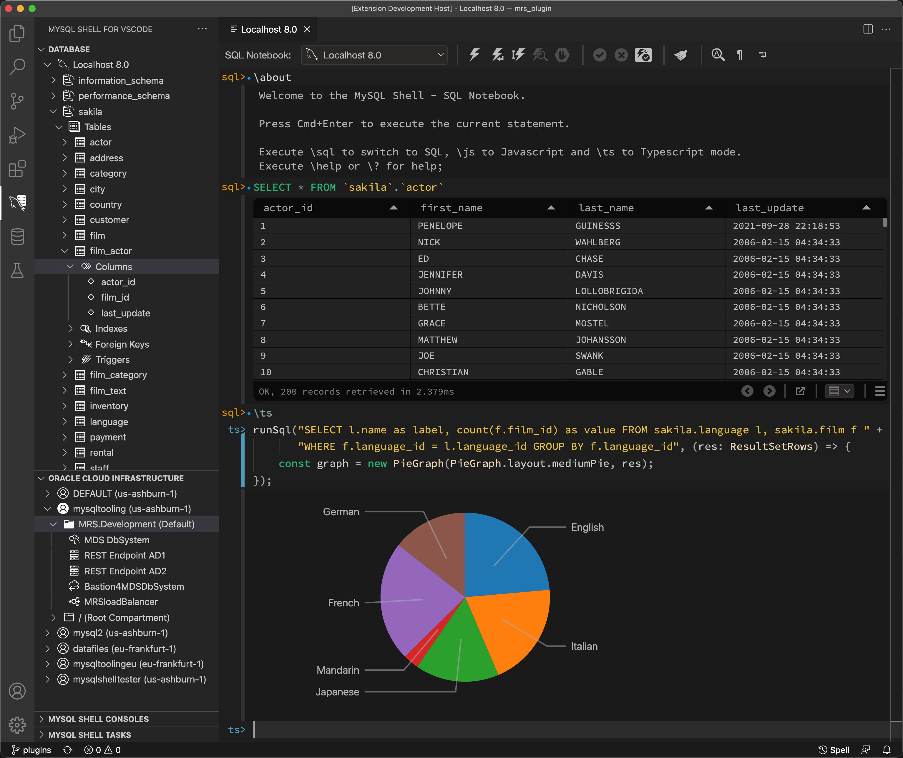
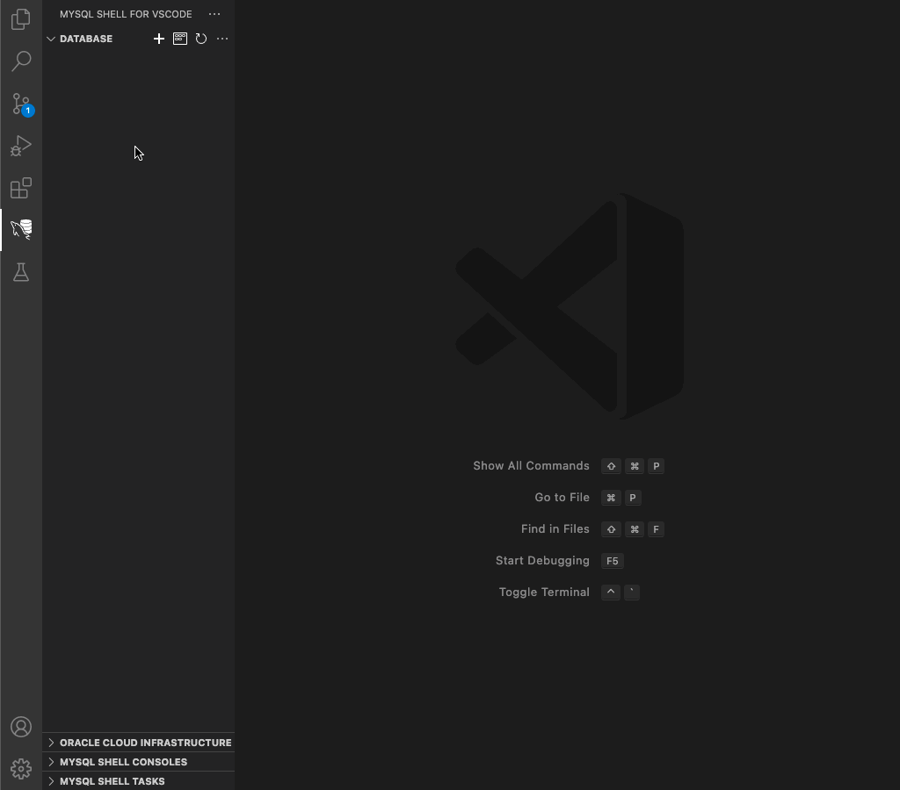
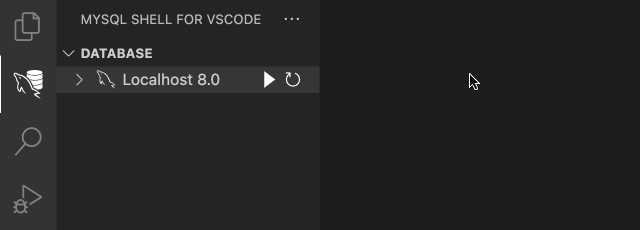

# MySQL Shell for VS Code 1.18.0+9.1.0

The MySQL Shell for VS Code extension integrates the powerful feature set of MySQL Shell - an advanced MySQL client for developers and DBAs - directly into VS Code.

It provides a modern notebook interface to interactively work with and execute SQL against MySQL databases and the HeatWave service, as well as a traditional SQL script-based workflow.

## Tutorials

How to Create a New Database Connection

## Feature Highlights

### Full OCI HeatWave Integration

Fully supports HeatWave Chat and Lakehouse Navigator to upload documents to HeatWave Lakehouse and query them using natural language queries.

Browse and manage your HeatWave DB Systems on the Oracle Cloud Infrastructure.

Get immediate and secure access to all your MySQL instances on OCI through tunneled Bastion connections.

### Notebook Interface

The embedded DB Editor offers you a fresh way to work interactively with your database.

Switch from SQL to JavaScript or TypeScript to query, manipulate, and visualize your data.

### MySQL Shell GUI Console

Provides the full power of the MySQL Shell inside a notebook-interface-styled editor.

Multi-line command editing, interactive auto-completion, and powerful plugins.

### Tight Workflow Integration

MySQL Shell for VS Code integrates seamlessly into your development workflow.

Takes SQL embedded in your source files and runs it inside the DB Editor. Updates modified SQL in your source file.

### Features Include

- Database Connection Manager:
  - Management of database connections to MySQL Server and MySQL Database Service (MHS) instances.
  - Browse through schema catalog
  - Dump schemas and load schemas with support for MHS instances
  - Open DB Editor for a database connection
  - Open MySQL Shell GUI Console for a database connection
- Oracle Cloud Infrastructure (OCI) Browser
  - Support for standard OCI profile configuration
  - Browse OCI compartments, MySQL DB Systems, Bastions, Compute Instances, and Load Balancers
  - Start/Stop operations for MySQL DB Systems
  - Creation of OCI Bastions and tunneled connections to MHS instance on private OCI networks
- DB Editor to work with live database connections:
  - Notebook Interface
  - Support for SQL, TypeScript, and JavaScript to work with the database
  - Auto-completion for SQL, TypeScript and JavaScript
  - Query result set browsing in a paged result grid
  - Support for multiple result sets in tabbed result grids
  - Support for text output for TypeScript and JavaScript code
  - Support for graphs for TypeScript and JavaScript code
- MySQL Shell GUI Console:
  - Notebook Interface
  - Support for SQL, Python, and JavaScript
  - Query result set browsing in a result grid
- Execute SQL from source files in DB Editor:
  - Execute any selected SQL commands from SQL files
  - Execute multi-line SQL blocks from Python files
    - Update original Python files with changes made in DB Editor

## How to report a bug

To file a bug report, select the following menu item or go to [bugs.mysql.com](https://bugs.mysql.com/report.php?category=Shell%20VSCode%20Extension).

## Supported Platforms

| OS      | Version/Dependency | Architecture |
|---------|--------------------|--------------|
| macOS   | 14 and higher      | arm64, x64   |
| Windows | 11 and higher      | x64          |
| Linux   | glibc 2.28         | arm64, x64   |

### Tested Linux Distributions

| Linux Distribution  | Releases          |
|---------------------|-------------------|
| Debian              | 12                |
| Ubuntu              | 22.04, 24.04      |
| Ubuntu-WSL2         | 22.04             |
| Kubuntu             | 22.04, 24.04      |
| Oracle Linux/RedHat | 7, 8, 9           |
| Fedora              | 40                |
| Raspberry Pi OS     | January 28th 2022 |

If you have successfully tested the extension on other Linux distributions, please let us know by filing a [bugs report](https://bugs.mysql.com/report.php?category=Shell%20VSCode%20Extension).

Copyright &copy; 2022, 2024, Oracle and/or its affiliates.
