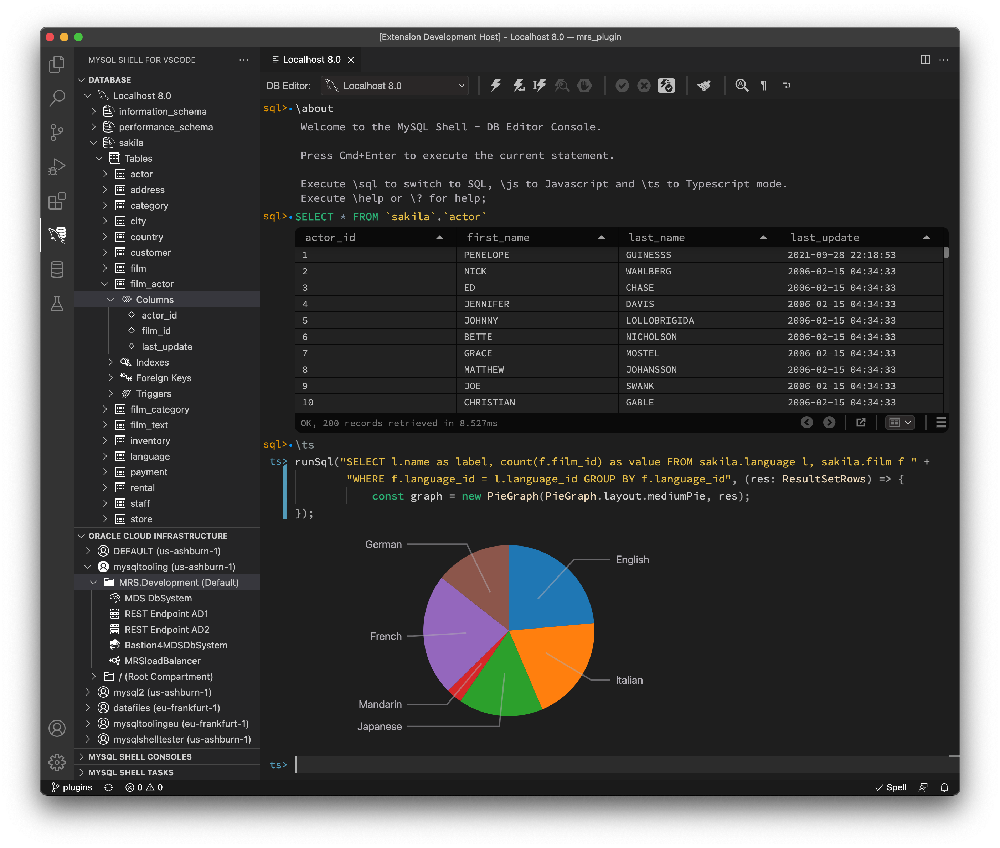

<!-- Copyright (c) 2022, 2024, Oracle and/or its affiliates.

This program is free software; you can redistribute it and/or modify
it under the terms of the GNU General Public License, version 2.0,
as published by the Free Software Foundation.

This program is designed to work with certain software (including
but not limited to OpenSSL) that is licensed under separate terms, as
designated in a particular file or component or in included license
documentation.  The authors of MySQL hereby grant you an additional
permission to link the program and your derivative works with the
separately licensed software that they have either included with
the program or referenced in the documentation.

This program is distributed in the hope that it will be useful,  but
WITHOUT ANY WARRANTY; without even the implied warranty of
MERCHANTABILITY or FITNESS FOR A PARTICULAR PURPOSE.  See
the GNU General Public License, version 2.0, for more details.

You should have received a copy of the GNU General Public License
along with this program; if not, write to the Free Software Foundation, Inc.,
51 Franklin St, Fifth Floor, Boston, MA 02110-1301 USA -->

<!-- cSpell:ignore pandoc -->

# MySQL Shell GUI Frontend

MySQL Shell GUI is a next generation MySQL client tool, developed by the same team which wrote [MySQL Workbench](https://github.com/mysql/mysql-workbench). It is the core of the [MySQL Shell for VS Code extension](https://marketplace.visualstudio.com/items?itemName=Oracle.mysql-shell-for-vs-code). It is part of the [MySQL Shell Plugins](../../readme.md) repository.

The tool implements a multi language code editor, which allows to mix MySQL and scripting languages like Javascript and Typescript (in Shell sessions MySQL, Javascript and Python). It provides code completion for all supported languages and code hints for parameters and MySQL built-in functions. It combines the advantages of a terminal and a GUI application.



MySQL Shell GUI frontend (FE) is a part of the [MySQL Shell](https://dev.mysql.com/doc/mysql-shell/8.0/en/). It is served by a dedicated [GUI plugin](../backend/gui_plugin/) which also offers a websocket connection which allows the frontend (FE) to run SQL queries and call other MySQL Shell plugins, like the MDS plugin (OCI HeatWave management) and MRS plugin (MySQL REST Service management).

# Contributing to MySQL Shell GUI

This frontend folder is part of a monorepo, which consists of all required parts to build the *MySQL Shell for VS Code*. The development setup is based on Visual Studio Code, Node.js, Vite (with its dependencies esbuild and rollup) and Jest for testing. Hence you need VS Code and Node.js (>= 16.x) installed. Recommended is Node.js 19.3.0 or later.

The [top level readme](../../readme.md) file explains in more details the overall structure of this repository. Here we focus mostly on the frontend aspects.

## Installation

After checking out the entire monorepo ([mysql-shell-plugins](https://github.com/mysql/mysql-shell-plugins)) switch to the folder `gui/frontend/` (the folder with this readme file) and run

```bash
npm install
```

in a terminal to download all dependencies. This prepares the Shell GUI frontend for both debugging and deployment.

## Deployment

The MySQL Shell GUI app consists of two parts: the web client and a server (MySQL Shell running the GUI plugin). The backend setup in the [backend readme](../backend/readme.md) describes functionality and setup of the server. To create a production build of the app run:

```bash
npm run build
```

in the `gui/frontend/` folder. This will create a new folder `build` with all the bundles the web server needs. After this step you can either create a new extension package (see [extension readme](../extension/README.md)) or manually set up the MySQL Shell with the required plugins to serve the build folder. However, this setup is officially not yet supported and will be part of a later release.

## Development

The setup for development is a bit more complex, because it is necessary to let the Shell work with the repo plugin sources instead of installed plugins, and the production build, so that the code can be debugged. The required steps to set up the backend is also described in the [backend readme](../backend/readme.md).

In this setup only the websocket connection to the Shell is used, while the web pages are served from the Vite dev server. Still, the production build (as described in the previous paragraph) must exist, or the Shell will complain on startup, even though it's not used.

MSG is designed to run over a secure connection (`https` and `wss`), but during development there's no need to take the extra burden of managing a self signed certificate for localhost. We can use an insecure connection there.

The dev server is configured to run on port `3001` (see `vite.config.ts`) and the debug launch configs use this port to connect the browser to the dev server. So, if you want to use a different port, change it in both locations. The shell web server is started via a shell script, triggered from the NPM script `launch-shell-web-server`, as mentioned below. This script contains the port setting (`8000`) for the Shell web server and the application uses this port automatically when debugging the app. Hence, changing this port requires a code change.

### Visual Studio Code

There are two VS Code workspaces in the repo:

- `MySQLShellPluginDevelopment.code-workspace`: the "big" one, which contains references to all parts of the repo (MRS plugin, MDS plugin, GUI plugin, VS Code extension, MSG frontend) and
- `gui/mysql-shell.code-workspace`: the "small" one, which only contains the parts required for the frontend and the extension (GUI plugin, VS Code extension, MSG frontend).

Since each workspace folder contributes to various lists in VS Code (debug launch tasks, NPM scripts etc.) it might be better to start with the smaller workspace, to ease orientation in the project structure.

#### Recommended VS Code extensions

For better code quality we use [ESLint](https://marketplace.visualstudio.com/items?itemName=dbaeumer.vscode-eslint) and [Code Spell Checker](https://marketplace.visualstudio.com/items?itemName=streetsidesoftware.code-spell-checker). For both tools there are configuration files in the repo and it is strongly recommend to install these VS Code extensions.

For testing it might be useful to install the [Jest extension](https://marketplace.visualstudio.com/items?itemName=Orta.vscode-jest), but it is not required. Tests can also be executed using NPM scripts, as described below.

### Debugging the Application

The repo comes with launch configs and tasks, ready for use. There are 4 configs to launch a browser (Firefox and Chrome) each with either a single user or multi user Shell configuration. Keep in mind the selected launch config must correspond to how the Shell server was started (single/multi user, secure/insecure, connection token) and you must have set up required prerequisites as described in the development paragraph.

The launch config only starts tsc in watch mode for type checks. The shell and the dev server each must be started manually, using the NPM scripts named `launch-shell-web-server` and `launch-dev-server`, respectively. By using the `NPM SCRIPTS` section in VS Code both are just a single click away.

Once both servers run you can start the debug session by selecting one of the launch configs and start that. It will open a browser instance with content served from the dev server. You should also see a flow of requests and responses in the Shell web server terminal while you interact with the application (the amount of logging depends on the log mode set when starting the Shell web server).

The debugging setup uses the single user mode of the GUI plugin, where a predefined local admin user is used, so that no manual login is required. This single user mode only works for local connections, because of the security implications that come with automatic logins. Multi user mode cannot be used currently, because it's currently not possible to create new user in a convenient way. Multi user support is planned for a later release.

## Testing

There are 2 test setups for the frontend. One is for unit and integration testing and the other for UI testing. Both use Jest as testing framework and can be started by the NPM scripts `unit-tests` and `e2e-tests-run` (e2e stands for end-to-end). For each type of setup there's a Jest configuration file, named `unit-tests.jest.config.ts` and `e2e.jest.config.ts`.

End-to-end tests need a MySQL database with some data. The folder `src/tests/e2e/sql` contains scripts that fill in the required test data. The MySQL server must support SSL. Use the ssl certificates in `frontend/src/tests/e2e/ssl_certificates` for the setup. The connection details to be used for e2e testing must be provided using environment variables, to keep this info secure. Define the following variables in your environment:

- DBHOSTNAME (e.g. localhost)
- DBUSERNAME (e.g. root)
- DBPASSWORD
- DBPORT     (e.g. the default port 3306)
- HEADLESS (optional) (1 - headless mode enabled / 0 - headless mode disabled)

With that in place you can start the tests using:

```bash
$ npm run unit-tests
```

and

```bash
$ npm run e2e-tests-run
```

The e2e tests run in headless mode by default and use multiple browser instances. If you want to see the browser opening and see the tests running just set the HEADLESS var to 0.

It is possible to run the e2e Jest tests in watch mode to automatically re-run your tests whenever they change:

```bash
$ npm run e2e-test-run -- --watch
```

Another helpful flag is `--runInBand` to run tests sequentially, instead of in parallel:

```bash
$ npm run e2e-test-run -- --runInBand
```

Configuration values can be injected in the tests by specifying them as globals when running Jest:

```bash
$ npm run e2e-test-run --globals "{\"baseUrl\": \"https://example.com\"}
```

Copyright &copy; 2020, 2024, Oracle and/or its affiliates.
