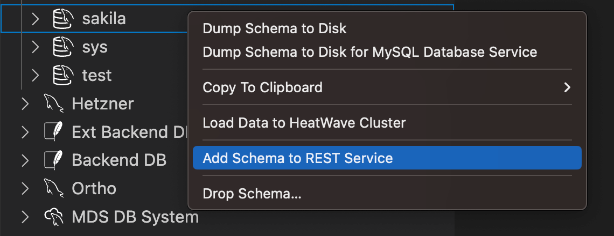

<!-- Copyright (c) 2022, 2023, Oracle and/or its affiliates.

This program is free software; you can redistribute it and/or modify
it under the terms of the GNU General Public License, version 2.0,
as published by the Free Software Foundation.

This program is also distributed with certain software (including
but not limited to OpenSSL) that is licensed under separate terms, as
designated in a particular file or component or in included license
documentation.  The authors of MySQL hereby grant you an additional
permission to link the program and your derivative works with the
separately licensed software that they have included with MySQL.
This program is distributed in the hope that it will be useful,  but
WITHOUT ANY WARRANTY; without even the implied warranty of
MERCHANTABILITY or FITNESS FOR A PARTICULAR PURPOSE.  See
the GNU General Public License, version 2.0, for more details.

You should have received a copy of the GNU General Public License
along with this program; if not, write to the Free Software Foundation, Inc.,
51 Franklin St, Fifth Floor, Boston, MA 02110-1301 USA -->

# Adding Database Schemas and Objects to a REST Service

Adding database schema objects (tables, views, or procedures) to a MySQL REST Service (MRS) allows them to be accessed through RESTful Web services. Before database schema object can be added, the database schema containing those objects has to be added to the REST service first.

The following figure shows the a REST schema and its REST objects.


Note: Adding a database schema is not equivalent to exposing all tables and views in the schema through the RESTful Web service. It just means making the MySQL REST Service aware that the schema exists and that it may have zero or more resources to expose to HTTP/S.

## Preconditions for Adding Database Schemas and Objects

Before adding REST schemas and objects, ensure that the following preconditions are met:

- A REST service must be added first (see [Adding a REST Service](#adding-a-rest-service)).
- The MySQL account used to connect to the targeting MySQL Solution needs to be granted the `mysql_rest_service_schema_admin` MySQL role or a superset of privileges.

To grant the `mysql_rest_service_schema_admin` MySQL role, execute the following SQL statement.

```sql
GRANT 'mysql_rest_service_schema_admin' TO 'user_account'@'%';

-- Please ensure to include all roles in the next statement
-- that should become active when the user connects
ALTER USER 'user_account'@'%' DEFAULT ROLE 'mysql_rest_service_schema_admin';
```

## Adding a Database Schema

It is possible to add MySQL database schemas by using MySQL Shell for VS Code through dialogs, MySQL Shell directly on the command line, or with scripts.

### Adding a Schema with MySQL Shell for VS Code

To add a database schema to a REST service:

1. Right-click the schema in the DATABASE CONNECTIONS view and select `Add Schema to REST Service` to open a dialog from which you set all REST schema parameters.

2. Click `OK` to add the schema.



### Adding a Schema with MySQL Shell

To add a database schema to a REST service, call the `mrs.add.schema()` function.

When started without parameters, an interactive wizard prompts you for the required parameters.

```bash
 MySQL > localhost:33060+ > JS > mrs.add.schema()
   1 information_schema
   2 performance_schema
   3 sys
   4 sakila
   5 test
   6 forum
   7 ortho
   8 mrs_notes

Please enter the name or index of a schema: 4
Please enter the request path for this schema [/sakila]: /sakila
Should the schema require authentication [y/N]: 
How many items should be listed per page [Schema Default]: 
Comments: 
Options: 

Service with path /sakila created successfully.
```

Execute the following command to get detailed help information about the `mrs.add.schema()` function.

```js
\? mrs.add.schema
```

### REST Schema Properties

Each REST schema has a common set of properties.

| Option | Description |
| --- | ----- |
| MRS Service Path | The path of the REST service for this REST schema |
| Comments | Comments to describe this MRS schema |
| REST Schema Path | The request path to access the schema (must start with /) |
| Schema Name | The name of the corresponding database schema |
| Items per Page | The default number of items to be returned when requesting REST objects of this schema |
| Enabled | Whether or not the REST objects of this REST schema are exposed through the REST interface |
| Requires Authentication | Whether or not authentication is required to access the REST objects of this REST schema |
| Options | Additional options in JSON format |

## Adding a Database Object

It is possible to add MySQL database schema objects (tables, views, and stored procedures) by using MySQL Shell for VS Code through dialogs, MySQL Shell directly on the command line, or with scripts.

### Adding a Database Object with MySQL Shell for VS Code

To add a database schema object to a REST schema:

1. Right-click on the database object in the DATABASE CONNECTIONS view and select `Add Database Object to REST Service`. This will open the [MySQL REST Object dialog](#mysql-rest-object-dialog-reference).

2. Adjust all REST object settings accordingly.

3. Press `OK` to add the database schema object.


### Adding a Database Object with MySQL Shell

To add a database schema to a REST service call the `mrs.add.dbObject()` function.

When started without parameters, an interactive wizard prompts you for the required parameters.

```bash
MySQL > localhost:33060+ > JS > mrs.add.dbObject()
   1 mrs_notes
   2 sakila

Please enter the name or index of a schema: 2
   1 TABLE
   2 VIEW
   3 PROCEDURE

Please enter the name or index of a database object type [TABLE]: 
   1 actor
   2 address
   3 category
   4 city
   5 country
   6 customer
   7 film
   8 film_actor
   9 film_category
  10 film_text
  11 inventory
  12 language
  13 payment
  14 rental
  15 staff
  16 store

Please enter the name or index of an database object: 4
Please enter the request path for this object [/city]: 
   1 CREATE
   2 READ
   3 UPDATE
   4 DELETE

Please select the CRUD operations that should be supported, '*' for all [READ]: 
   1 FEED
   2 ITEM
   3 MEDIA

Please select the CRUD operation format [FEED]: 
Should the db_object require authentication [y/N]: 
Should row ownership be required when querying the object [y/N]: 
How many items should be listed per page [Schema Default]: 
Comments: 

Object added successfully.
```

Execute the following command to get detailed help information about the `mrs.add.dbObject()` function.

```js
\? mrs.add.dbObject
```

## MySQL REST Object Dialog Reference

The MySQL REST Object dialog is used to design the representation of a database schema object on the MySQL REST Service.

The following aspects can be set through the dialog.

- Basic
  - The database schema object that should be exposed via MRS
  - The URL path of how to access the REST object
- Security
  - Whether the object is publicly available or requires authentication
  - The CRUD operations that are allowed
  - The CRUD operations that are allowed on referenced tables
  - Whether row ownership should be enforced to enable row level security
- JSON/Relation Duality
  - Which columns of the database schema object should be exposed and how they should be named
  - Which referenced tables should be included, either nested or unnested or reduced to a single field


### Building a JSON/Relational Duality View

A simple 1:1 mapping between the REST DB Object and the corresponding relational table is automatically created when [adding a database object](#adding-a-database-object-with-mysql-shell).

No changes need to be applied on the MySQL REST Object Dialog, except unchecking the `Requires Auth` checkbox if the REST object should be available without login.

> Note: If the `Requires Auth` checkbox has been unchecked, the REST object will be publicly available to anybody who can access the REST URL.

#### Enabling CRUD Operations

Since only the READ CRUD operation is enabled by default (see the `R` being highlighted next to the relational object), only read commands will be allowed on the REST object. To change this, toggle each letter (`R` - Read, `C` - Create, `U` - Update and `D` - Delete) to enable or disable the corresponding functionality.

| Letter | CRUD Operation | SQL Operation |
|---|---|---|
| C | CREATE | CREATE |
| R | READ | SELECT |
| U | UPDATE | UPDATE |
| D | DELETE | DELETE |

#### Interactively Query the REST Object

After clicking `OK` to close the MySQL REST Object dialog, the DB Notebook will be visible again.

Switch the DB Notebook to TypeScript mode with `\ts` if it is still in SQL mode. Now it is possible to interactively query the REST object using the [MRS SDK Client API](sdk.html).

```js
\ts
```

If some of the REST objects require authenticate and a REST Authentication App has been added to the REST service, use the `authenticate()` function of the REST service Client API object. This will show an login dialog where the credentials of a user account can be specified.

```js
myService.authenticate();
```

> The `authenticate()` function only works with the built in MRS authentication vendor. Please make sure to set this vendor when adding the REST Authentication App.

In the following examples case the `sakila.city` database table was used, as can be seen in the screenshot above.

```js
myService.sakila.city.findFirst();
```

```json
{
   "city": "A Corua (La Corua)",
   "links": [
      {
         "rel": "self",
         "href": "/myService/sakila/city/1"
      }
   ],
   "cityId": 1,
   "countryId": 87,
   "lastUpdate": "2006-02-15 04:45:25.000000",
   "_metadata": {
      "etag": "EE93452B41984F3F5BBB0395CCB2CED00F5C748FEEA4A36CCD749CC3F85B7CEA"
   }
}
```

The fields can be filtered and a conditional where clause can be added. Please refer to the [MRS SDK Client API](sdk.html) documentation for more information.

```js
myService.sakila.city.findMany({select: ["city", "cityId"], where: {city: {$like: "NE%"}}});
```

```json
{
    "items": [
        {
            "city": "Newcastle",
            "links": [
                {
                    "rel": "self",
                    "href": "/myService/sakila/city/364"
                }
            ],
            "cityId": 364,
            "_metadata": {}
        },
        {
            "city": "Nezahualcyotl",
            "links": [
                {
                    "rel": "self",
                    "href": "/myService/sakila/city/365"
                }
            ],
            "cityId": 365,
            "_metadata": {
                "etag": "681C34301F6ED6FD1200505C9C2CFB90E3367A267B7AADBD85186D781FEC7C19"
            }
        }
    ],
    "limit": 25,
    "offset": 0,
    "hasMore": false,
    "count": 2,
    "links": [
        {
            "rel": "self",
            "href": "/myService/sakila/city/"
        }
    ]
}
```

To quickly edit a REST DB Object that has been interactively queried, the `edit()` function can be used.

```js
myService.sakila.city.edit()
```

### Creating a Nested JSON/Relational Duality View

By enabling a referenced table, the columns of that table are included as a nested entry in the JSON result. Please note that this works with 1:1 and 1:n relationships.


This leads to the following result.

```js
myService.sakila.city.findFirst();
```

```json
{
    "city": "A Corua (La Corua)",
    "links": [
        {
            "rel": "self",
            "href": "/myService/sakila/city/1"
        }
    ],
    "cityId": 1,
    "country": {
        "country": "Spain",
        "countryId": 87,
        "lastUpdate": "2006-02-15 04:44:00.000000"
    },
    "countryId": 87,
    "lastUpdate": "2006-02-15 04:45:25.000000",
    "_metadata": {
        "etag": "FFA2187AD4B98DF48EC40B3E807E0561A71D02C2F4F5A3B953AA6CB6E41CAD16"
    }
}
```

### Creating a JSON/Relational Duality View with an Unnested Referenced Table

If the columns of the referenced table should be added to the level above, the `Unnest` option can be enabled.


This leads to the following result.

```js
myService.sakila.city.findFirst();
```

```json
{
    "city": "A Corua (La Corua)",
    "links": [
        {
            "rel": "self",
            "href": "/myService/sakila/city/1"
        }
    ],
    "cityId": 1,
    "country": "Spain",
    "countryId": 87,
    "lastUpdate": "2006-02-15 04:45:25.000000",
    "_metadata": {
        "etag": "48889BABCBBA1491D25DFE0D7A270FA3FDF8A16DA8E44E42C61759DE1F0D6E35"
    }
}
```

### Creating a JSON/Relational Duality View with a Reduced Referenced Table

Instead of having all columns unnested and disabling all columns that are not wanted, the `Reduce to...` dropdown can be used to select the column that should be selected for the reduce operation.


This leads to the same result as the query above.

```js
myService.sakila.city.findFirst();
```

```json
{
    "city": "A Corua (La Corua)",
    "links": [
        {
            "rel": "self",
            "href": "/myService/sakila/city/1"
        }
    ],
    "cityId": 1,
    "country": "Spain",
    "countryId": 87,
    "lastUpdate": "2006-02-15 04:45:25.000000",
    "_metadata": {
        "etag": "48889BABCBBA1491D25DFE0D7A270FA3FDF8A16DA8E44E42C61759DE1F0D6E35"
    }
}
```
