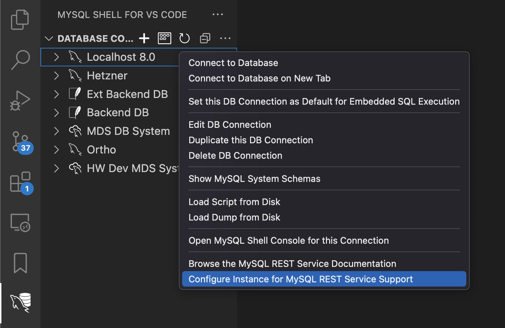

<!-- Copyright (c) 2022, 2023, Oracle and/or its affiliates.

This program is free software; you can redistribute it and/or modify
it under the terms of the GNU General Public License, version 2.0,
as published by the Free Software Foundation.

This program is also distributed with certain software (including
but not limited to OpenSSL) that is licensed under separate terms, as
designated in a particular file or component or in included license
documentation.  The authors of MySQL hereby grant you an additional
permission to link the program and your derivative works with the
separately licensed software that they have included with MySQL.
This program is distributed in the hope that it will be useful,  but
WITHOUT ANY WARRANTY; without even the implied warranty of
MERCHANTABILITY or FITNESS FOR A PARTICULAR PURPOSE.  See
the GNU General Public License, version 2.0, for more details.

You should have received a copy of the GNU General Public License
along with this program; if not, write to the Free Software Foundation, Inc.,
51 Franklin St, Fifth Floor, Boston, MA 02110-1301 USA -->

# Configuration of the MySQL REST Service

To configure the MySQL REST Service (MRS), the following steps need to be taken.

1. Deployment of a MySQL solution
2. Configuration of the MRS metadata database schema
3. Creation of MySQL user account for MySQL Router access
4. Configuration of one or more MySQL Router instances for MRS

After these steps have been performed, the MySQL REST Service is ready to serve REST services.

## Deployment of a MySQL solution

The following MySQL solutions are supported.

- MySQL HeatWave
- MySQL InnoDB Cluster
- MySQL InnoDB ClusterSet
- MySQL InnoDB ReplicaSet
- MySQL Operator

For development purposes, a standalone MySQL Server setup is also supported. Please note that this setup should not be used in a production deployment since it does not offer any form of High Availability (HA).

- Standalone MySQL Server

Please refer to the corresponding documentation on how to deploy and configure the different MySQL solutions.

## Configuration of the MRS metadata schema

The MySQL REST Service stores its configuration in the `mysql_rest_service_metadata` database schema. To deploy the metadata schema, perform one of the following tasks.

### MRS Configuration via MySQL Shell

Open a terminal, start the MySQL Shell and connect to the MySQL setup.

    mysqlsh dba@localhost

Configure the metadata schema via the MRS plugin by executing `mrs.configure()`.

    MySQL> localhost:33060+> JS> mrs.configure()
    MySQL Rest Data Service configuration.
    
    Checking MRS metadata schema and version...
    Creating MRS metadata schema...
    The MRS metadata is well configured, no changes performed.

The MRS metadata schema has now been configured.

### MRS Configuration via MySQL Shell for VS Code

Start VS Code and install the MySQL Shell for VS Code extension, then add a connection to the MySQL setup.

Right click on the connection in the DATABASE CONNECTIONS view and select Configure Instance for MySQL REST Service Support.

The MRS metadata schema has now been configured.

## Configuration of MySQL Routers

MySQL Routers are an essential part of any MySQL solution and therefore often deployed in the same step as the MySQL Servers. Please see the MySQL Router documentation for more details.

When deploying a new MySQL Router it is advised to use the `mysqlrouter_bootstrap` command to bootstrap and configure the router, including the MRS configuration.

    mysqlrouter_bootstrap dba@127.0.0.1:13000 --mrs --directory ~/.mysqlrouter

Please follow the interactive steps on the command line to configure the router.

**_Manual Creation of MySQL User Account for MySQL Router access_**

When using the `mysqlrouter_bootstrap` command to configure the MySQL Router for MRS access the user accounts described in this section can be created automatically.

If you want to manually manage the required MySQL accounts for use access the following steps need to be performed.

1. Creation of the MySQL user account(s)
   - If only one account is specified, the MySQL Router will use it to access both the MRS metadata schema and application schema data. This account must have the `mysql_rest_service_meta_provider` and `mysql_rest_service_data_provider` roles.
   - If two accounts are used, the MySQL Router will use one for the MRS metadata schema access and the other one for the application schema data. Assign the `mysql_rest_service_meta_provider` role to one user and `mysql_rest_service_data_provider` to the other.
2. Bootstrapping the MySQL Routers using the created MySQL accounts via the following options
   - `--mrs-mysql-metadata-account` used by the router to access the MRS metadata schema
   - `--mrs-mysql-data-account` used by the router to access the application schema

As part of the MRS metadata schema creation, two SQL ROLEs have been created for MySQL Router to access MySQL.

- The 'mysql_rest_service_meta_provider' ROLE grants access to the required MRS metadata schema tables.
- The 'mysql_rest_service_data_provider' ROLE grants access to the served schema objects in the application database schemas.

To create the MySQL account, connect to the MySQL setup with the MySQL Shell or MySQL Shell for VS Code and execute the following SQL statements.

    CREATE USER 'mysqlrouter_mrs_<router_name>'@'<router_host>' IDENTIFIED BY 'password';
    GRANT 'mysql_rest_service_meta_provider', 'mysql_rest_service_data_provider' TO 'mysqlrouter_mrs_<router_name>'@'<router_host>';

The user name specified above can then be used when calling the `mysqlrouter_bootstrap` command.

    --mrs-mysql-metadata-account=USER_NAME
    --mrs-mysql-data-account=USER_NAME

**_Adding a MRS configuration to an existing MySQL Router configuration_**

In case your MySQL Routers have already been configured it is possible to add the MRS configuration later on.

To get the path of the existing configuration file, execute `mysqlrouter --help`. This will show the exact location of the router config file.

The following is an example when connecting to a single development server.

    [DEFAULT]
    logging_folder = /var/log/mysqlrouter
    runtime_folder = /var/run/mysqlrouter
    config_folder = /etc/mysqlrouter
    
    [logger]
    level = DEBUG
    
    [routing:mrs_rw]
    bind_address=0.0.0.0
    bind_port=6446
    destinations=10.0.1.135:3306
    routing_strategy=round-robin
    protocol=classic

To enable MRS support on the router, the configuration file needs to be extended with the [http_server] section and the [rest_mrs] section.

It is advised to use the `mysqlrouter_bootstrap` command to configure the router for MRS.

    mysqlrouter_bootstrap dba@127.0.0.1:13000 --mrs --directory /export/mysql/src/mysql-trunk/boot

The following parameters can be used to set the MRS configuration options.

    --mrs
    --mrs-mysql-metadata-account=USER_NAME
    --mrs-mysql-data-account=USER_NAME
    --mrs-global-secret=SECRET

The following is an example when connecting to a single development server and serving the REST services via HTTP.

    [http_server]
    port=8080
    ssl=0
    static_folder=/var/run/mysqlrouter/www/

    [mysql_rest_service]
    mysql_user=mysqlrouter_mrs
    mysql_read_write_route=mrs_rw
