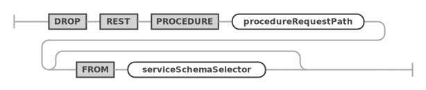
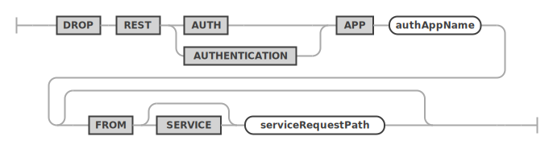
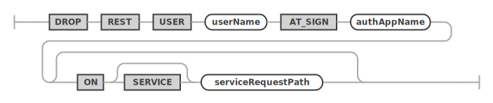

<!-- Copyright (c) 2022, 2023, Oracle and/or its affiliates.

This program is free software; you can redistribute it and/or modify
it under the terms of the GNU General Public License, version 2.0,
as published by the Free Software Foundation.

This program is also distributed with certain software (including
but not limited to OpenSSL) that is licensed under separate terms, as
designated in a particular file or component or in included license
documentation.  The authors of MySQL hereby grant you an additional
permission to link the program and your derivative works with the
separately licensed software that they have included with MySQL.
This program is distributed in the hope that it will be useful,  but
WITHOUT ANY WARRANTY; without even the implied warranty of
MERCHANTABILITY or FITNESS FOR A PARTICULAR PURPOSE.  See
the GNU General Public License, version 2.0, for more details.

You should have received a copy of the GNU General Public License
along with this program; if not, write to the Free Software Foundation, Inc.,
51 Franklin St, Fifth Floor, Boston, MA 02110-1301 USA -->

# DROP

## DROP REST SERVICE

An existing REST service can be dropped by using the `DROP REST SERVICE` statement.

**_SYNTAX_**

dropRestServiceStatement ::=


**_Examples_**

The following example drops a REST service with the request path `/myService`.

```sql
DROP REST SERVICE /myService;
```

## DROP REST SCHEMA

An existing REST schema can be dropped by using the `DROP REST SCHEMA` statement.

**_SYNTAX_**

dropRestSchemaStatement ::=


**_Examples_**

The following example drops a REST schema using the request path `/myService`.

```sql
DROP REST SCHEMA /sakila FROM SERVICE /myService;
```

## DROP REST DUALITY VIEW

The `DROP REST DUALITY VIEW` statement is used to drop existing REST duality views.

**_SYNTAX_**

dropRestDualityViewStatement ::=


**_Examples_**

The following example drops a REST duality view using the request path `/city`.

```sql
DROP REST DUALITY VIEW /city
FROM SERVICE /myService SCHEMA /sakila;
```

## DROP REST PROCEDURE

The `DROP REST PROCEDURE` statement is used to drop an existing REST procedures.

**_SYNTAX_**

dropRestProcedureStatement ::=


## DROP REST CONTENT SET

The `DROP REST CONTENT SET` statement is used to drop an existing REST static content set.

**_SYNTAX_**

dropRestContentSetStatement ::=


## DROP REST AUTH APP

The `DROP REST AUTH APP` statement is used to drop an existing REST authentication app from a REST service.

**_SYNTAX_**

dropRestAuthAppStatement ::=


## DROP REST USER

The `DROP REST USER` statement is used to drop an existing REST user from a REST authentication app.
**_SYNTAX_**

dropRestUserStatement ::=

