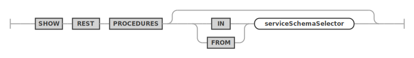

<!-- Copyright (c) 2022, 2023, Oracle and/or its affiliates.

This program is free software; you can redistribute it and/or modify
it under the terms of the GNU General Public License, version 2.0,
as published by the Free Software Foundation.

This program is also distributed with certain software (including
but not limited to OpenSSL) that is licensed under separate terms, as
designated in a particular file or component or in included license
documentation.  The authors of MySQL hereby grant you an additional
permission to link the program and your derivative works with the
separately licensed software that they have included with MySQL.
This program is distributed in the hope that it will be useful,  but
WITHOUT ANY WARRANTY; without even the implied warranty of
MERCHANTABILITY or FITNESS FOR A PARTICULAR PURPOSE.  See
the GNU General Public License, version 2.0, for more details.

You should have received a copy of the GNU General Public License
along with this program; if not, write to the Free Software Foundation, Inc.,
51 Franklin St, Fifth Floor, Boston, MA 02110-1301 USA -->

# USE and SHOW

## USE

An existing REST service can be dropped by using the `DROP REST SERVICE` statement.

**_SYNTAX_**

useStatement ::=


serviceAndSchemaRequestPaths ::=


**_Examples_**

The following example makes the REST service with the request path `/myService` the new default REST service.

```sql
USE REST SERVICE /myService;
```

After the default REST service has been set, the following statement can be used to set the default REST schema.

```sql
USE REST SCHEMA /sakila;
```

The next example shows how to set the default REST service and REST schema in a single statement.

```sql
USE REST SERVICE /myService SCHEMA /sakila;
```

## SHOW REST STATUS

The `SHOW REST STATUS` statement is used to get basic information about the current status of the MySQL REST Service.

**_SYNTAX_**

showRestMetadataStatusStatement ::=


**_Examples_**

The following example drops a REST schema using the request path `/myService`.

```sql
SHOW REST STATUS;
```

## SHOW REST SERVICES

The `SHOW REST SERVICES` statement lists all available REST services.

**_SYNTAX_**

showRestServicesStatement ::=


**_Examples_**

The following example lists all REST services.

```sql
SHOW REST SERVICES;
```

## SHOW REST SCHEMAS

The `SHOW REST SCHEMAS` statement lists all available REST schemas of the given or current REST service.

**_SYNTAX_**

showRestSchemasStatement ::=


**_Examples_**

The following example lists all REST schemas of the REST service using the request path `/myService`.

```sql
SHOW REST SERVICES FROM /myService;
```

## SHOW REST DUALITY VIEWS

The `SHOW REST DUALITY VIEWS` statement lists all available REST duality views of the given or current REST schema.

**_SYNTAX_**

showRestViewsStatement ::=


serviceSchemaSelector ::=


**_Examples_**

The following example lists all REST duality views of the given REST schema.

```sql
SHOW REST DUALITY VIEWS FROM SERVICE /myService SCHEMA /sakila;
```

## SHOW REST PROCEDURES

The `SHOW REST PROCEDURES` statement lists all available REST procedures of the given or current REST schema.

**_SYNTAX_**

showRestProceduresStatement ::=


serviceSchemaSelector ::=


**_Examples_**

The following example lists all REST procedures of the given REST schema.

```sql
SHOW REST PROCEDURES FROM SERVICE /myService SCHEMA /sakila;
```

## SHOW REST CONTENT SETS

The `SHOW REST CONTENT SETS` statement lists all available REST procedures of the given or current REST schema.

**_SYNTAX_**

showRestContentSetsStatement ::=


serviceSchemaSelector ::=


**_Examples_**

The following example lists all REST content sets of the given REST schema.

```sql
SHOW REST CONTENT SETS FROM SERVICE /myService SCHEMA /sakila;
```

## SHOW CREATE REST SERVICE

The `SHOW CREATE REST SERVICE` statement shows the corresponding DDL statement for the given REST service.

**_SYNTAX_**

showCreateRestServiceStatement ::=


**_Examples_**

The following example shows the DDL statement for the REST service with request path `/myService`.

```sql
SHOW CREATE REST SERVICE /myService;
```

## SHOW CREATE REST SCHEMA

The `SHOW CREATE REST SCHEMA` statement shows the corresponding DDL statement for the given REST schema.

**_SYNTAX_**

showCreateRestSchemaStatement ::=


**_Examples_**

The following example shows the DDL statement for the given REST schema.

```sql
SHOW CREATE REST SCHEMA /sakila FROM /myService;
```

## SHOW CREATE REST DUALITY VIEW

The `SHOW CREATE REST DUALITY VIEW` statement shows the corresponding DDL statement for the given REST duality view.

**_SYNTAX_**

showCreateRestViewStatement ::=


serviceSchemaSelector ::=


**_Examples_**

The following example shows the DDL statement for the given REST duality view.

```sql
SHOW CREATE REST DUALITY VIEW /city ON SERVICE /myService SCHEMA /sakila;
```

## SHOW CREATE REST PROCEDURE

The `SHOW CREATE REST PROCEDURE` statement shows the corresponding DDL statement for the given REST procedure.

**_SYNTAX_**

showCreateRestProcedureStatement ::=


serviceSchemaSelector ::=


**_Examples_**

The following example shows the DDL statement for the given REST procedure.

```sql
SHOW CREATE REST PROCEDURE /inventory_in_stock ON SERVICE /myService SCHEMA /sakila;
```
