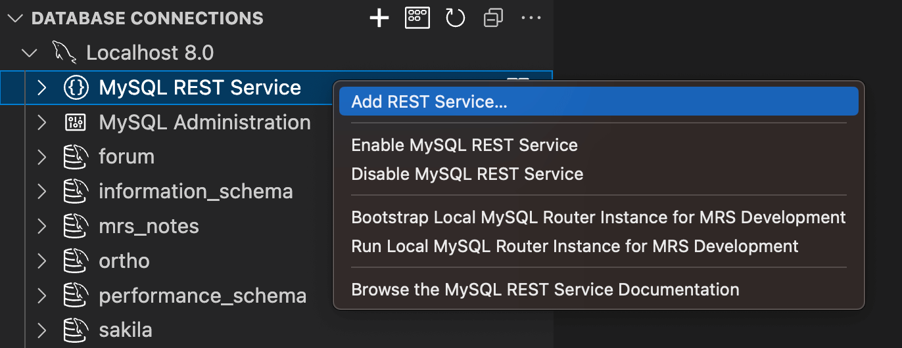
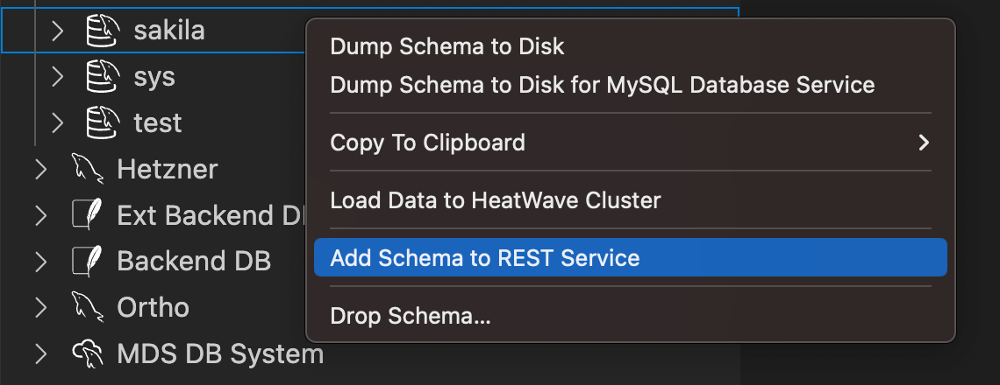
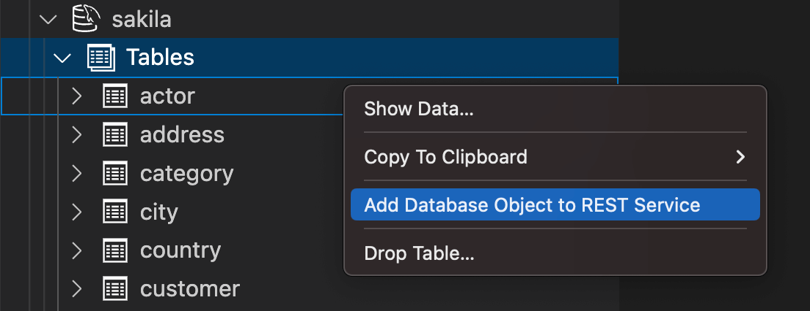

<!-- Copyright (c) 2022, 2025, Oracle and/or its affiliates.

This program is free software; you can redistribute it and/or modify
it under the terms of the GNU General Public License, version 2.0,
as published by the Free Software Foundation.

This program is designed to work with certain software (including
but not limited to OpenSSL) that is licensed under separate terms, as
designated in a particular file or component or in included license
documentation.  The authors of MySQL hereby grant you an additional
permission to link the program and your derivative works with the
separately licensed software that they have either included with
the program or referenced in the documentation.

This program is distributed in the hope that it will be useful,  but
WITHOUT ANY WARRANTY; without even the implied warranty of
MERCHANTABILITY or FITNESS FOR A PARTICULAR PURPOSE.  See
the GNU General Public License, version 2.0, for more details.

You should have received a copy of the GNU General Public License
along with this program; if not, write to the Free Software Foundation, Inc.,
51 Franklin St, Fifth Floor, Boston, MA 02110-1301 USA -->

# Adding REST Services and Database Objects

MRS supports the setup of a large number individual REST services.

Each REST service has its own settings for URL path, host name, supported protocols, authentication options, and other settings. A service can expose a selected list of database schemas and objects.

It is possible to perform an individual setup for each application and it is advised to setup an separate REST service for each application.

**_Preconditions for Adding a REST Service_**

Before setting up a new REST service, ensure that the following preconditions are met:

- The MySQL REST Service must be configured on the targeting MySQL Solution. Please see the [Configuration](#configuring-mysql-rest-service) section of this manual.
- The MySQL account used to connect to the targeting MySQL Solution needs to be granted the `mysql_rest_service_admin` MySQL role or a superset of privileges.

To grant the `mysql_rest_service_admin` MySQL role, execute the following SQL statement.

```sql
GRANT 'mysql_rest_service_admin' TO 'user_account'@'%';

-- Please ensure to include all roles in the next statement
-- that should become active when the user connects
ALTER USER 'user_account'@'%' DEFAULT ROLE 'mysql_rest_service_admin';
```

## Setting Up a New REST Service

A new REST service can be added in one of the following ways:

- MySQL Shell for VS Code provides a GUI dialog to create the REST service.
- MySQL Shell offers the MRS plugin that can be used to create a REST service interactively or with scripts in a terminal.
- When writing a script or plugin for MySQL Shell, the MRS plugin can be used to script the creation in Python or JavaScript.

### Adding a REST Service Using MySQL Shell for VS Code

After configuring the MySQL REST Service on the target MySQL instance, the DB Connection in the DATABASE CONNECTIONS view (when expanded) shows a new tree item, `MySQL REST Service`.

1. Right-click the tree item `MySQL REST Service` and select `Add REST Service...` from the list to display the MySQL REST Service dialog.

2. Specify values for the required parameters and click `OK` to add the new REST service.



### Adding a REST Service Using MySQL Shell

For MySQL Shell, the `mrs` plugin is used to work with the MySQL REST Service. The `mrs.add.service()` function adds a new REST service.

When started without parameters, an interactive wizard prompt you for the required parameters. For example:

```bash
MySQL > localhost:33060+ > Py > mrs.add.service()
Please enter the context path for this service [/mrs]: /myservice
Please enter the host name for this service (e.g. None or localhost) [None]:
   1 HTTP
   2 HTTPS

Please select the protocol(s) the service should support [HTTP,HTTPS]: 2
Comments:
   1 Default Service Options for Development
   2 No options
   3 Custom options

Please select how to initialize the options [Default Service Options for Development]:

Service /myservice created successfully.
```

Execute the following command to get detailed help information about the `mrs.add.service()` function.

```js
\? mrs.add.service
```

### REST Service Definitions

#### About MRS AutoREST

AutoREST is a quick and easy way to expose database schema tables, views, and procedures as REST resources.

#### REST APIs

Representational State Transfer (REST) is a style of software architecture for distributed hypermedia systems such as the World Wide Web. An API is described as RESTful when it conforms to the tenets of REST. Although a full discussion of REST is outside the scope of this document, a REST API has the following characteristics:

- Data is modelled as a set of resources. Resources are identified by URIs.

- A small, uniform set of operations are used to manipulate resources (for example, PUT, POST, GET, DELETE).

- A resource can have multiple representations (for example, a blog might have an HTML representation and an RSS representation).

- Services are stateless and since it is likely that the client will want to access related resources, these should be identified in the representation returned, typically by providing hypertext links.

#### RESTful Services Terminology

This section introduces some common terms that are used throughout this document:

- __RESTful service:__ An HTTP web service that conforms to the tenets of the RESTful architectural style.

- __Resource module:__ An organizational unit that is used to group related resource templates.

- __Resource template:__ An individual RESTful service that is able to service requests for some set of URIs (Universal Resource Identifiers). The set of URIs is defined by the URI Pattern of the Resource Template

- __URI pattern:__ A pattern for the resource template. Can be either a route pattern or a URI template, although you are encouraged to use route patterns.

- __Route pattern:__ A pattern that focuses on decomposing the path portion of a URI into its component parts. For example, a pattern of /:object/:id? will match /emp/101 (matches a request for the item in the emp resource with id of 101) and will also match /emp/ (matches a request for the emp resource, because the :id parameter is annotated with the ? modifier, which indicates that the id parameter is optional).

- __HTTP operation:__ HTTP (HyperText Transport Protocol) defines standard methods that can be performed on resources: GET (retrieve the resource contents), POST (store a new resource), PUT (update an existing resource), and DELETE (remove a resource).

## Adding a Database Schemas to a REST Service

For each MySQL database schema a corresponding REST schema can be created and added to a REST service. It is possible to add the same MySQL database schema to different REST services by creating several REST schemas for the MySQL database schema.

The REST schema can be created by using MySQL Shell for VS Code or MySQL Shell on the command line.

Note: Adding a database schema as a REST schema is not equivalent to exposing all tables and views in the schema through the RESTful Web service. It just means making the MySQL REST Service aware that the schema exists and that it may have zero or more resources to expose via HTTP/S.

**_Preconditions for Adding Database Schemas and Objects_**

Before adding REST schemas and objects, ensure that the following preconditions are met:

- A REST service must be added first (see [Adding a REST Service](#adding-rest-services-and-database-objects)).
- The MySQL account used to connect to the targeting MySQL Solution needs to be granted the `mysql_rest_service_schema_admin` MySQL role or a superset of privileges.

To grant the `mysql_rest_service_schema_admin` MySQL role, execute the following SQL statement.

```sql
GRANT 'mysql_rest_service_schema_admin' TO 'user_account'@'%';

-- Please ensure to include all roles in the next statement
-- that should become active when the user connects
ALTER USER 'user_account'@'%' DEFAULT ROLE 'mysql_rest_service_schema_admin';
```

### Adding a Schema via MRS DDL

On an active MySQL Shell connection execute the [CREATE REST SCHEMA](sql.html#create-rest-schema) DDL statement referencing the corresponding MySQL database schema in the FROM clause. Please see the MRS SQL Reference for more details.

**_Example_**

The following example adds a REST schema for the `sakila` database schema to the REST service `/myService`.

```sql
CREATE OR REPLACE REST SCHEMA /sakila ON SERVICE /myService
    FROM `sakila`
    COMMENT "The sakila schema";
```

### Adding a Schema using the MySQL Shell for VS Code UI

To add a database schema to a REST service:

1. Right-click the schema in the DATABASE CONNECTIONS view and select `Add Schema to REST Service`. This will open a dialog where all REST schema parameters can be set.

2. Click `OK` to add the schema.



### Adding a REST Schema with a MySQL Shell Script

To add a database schema to a REST service, call the `mrs.add.schema()` function.

When started without parameters, an interactive wizard prompts you for the required parameters.

```bash
 MySQL > localhost:33060+ > JS > mrs.add.schema()
   1 information_schema
   2 performance_schema
   3 sys
   4 sakila
   5 test
   6 forum
   7 ortho
   8 mrs_notes

Please enter the name or index of a schema: 4
Please enter the request path for this schema [/sakila]: /sakila
Should the schema require authentication? [y/N]:
How many items should be listed per page? [Schema Default]:
Comments:
Options:

Service with path /sakila created successfully.
```

Execute the following command to get detailed help information about the `mrs.add.schema()` function.

```js
\? mrs.add.schema
```

## Adding a Schema Table, View or Procedure

Adding database schema objects (tables, views, or procedures) to a MySQL REST Service (MRS) allows them to be accessed through RESTful Web services. Before database schema object can be added as REST objects, the database schema containing those objects has to be added as a REST schema.

The following figure shows the a REST schema and its REST objects.


Once a MySQL database schema has been added as a REST schema, its objects can be added. Database schema tables and views are added as [REST data mapping views](#rest-data-mapping-views), stored procedures are added as REST procedures.

> Note: REST data mapping views enabled application developers to take a document centric approach when implementing their applications. Please refer to the [JSON data mapping view](#rest-data-mapping-views) section of this document to learn about the advantages of using REST data mapping views.

The MySQL database schema objects can be added by using MySQL Shell for VS Code or MySQL Shell on the command line.

### Adding a Schema Object via MRS DDL

On an active MySQL Shell connection execute the [CREATE REST DATA MAPPING VIEW](sql.html#create-rest-view) DDL statement to add a database schema table or view as REST object. Please see the [MRS SQL Reference](sql.html#create-rest-view) for more details.

To add a stored procedure the [CREATE REST PROCEDURE](sql.html#create-rest-procedure) DDL statement can be used.

**_Examples_**

The following example adds a REST data mapping view for the `sakila.city` database schema table.

```sql
CREATE REST VIEW /city
ON SERVICE /myService SCHEMA /sakila
AS `sakila`.`city` {
    cityId: city_id @SORTABLE,
    city: city,
    countryId: country_id,
    lastUpdate: last_update
}
AUTHENTICATION REQUIRED;
```

The next example adds a REST procedure for the `sakila.film_in_stock` database schema stored procedure.

```sql
CREATE OR REPLACE REST PROCEDURE /filmInStock
AS `sakila`.`film_in_stock`
PARAMETERS {
    pFilmId: p_film_id @IN,
    pStoreId: p_store_id @IN,
    pFilmCount: p_film_count @OUT
}
RESULT MyServiceSakilaFilmInStock {
    inventoryId: inventory_id @DATATYPE("int")
}
AUTHENTICATION REQUIRED;
```

### Adding a Schema Object with MySQL Shell for VS Code UI

To add a database schema object to a REST schema:

1. Right-click on the database object in the DATABASE CONNECTIONS view and select `Add Database Object to REST Service`. This will open the [MySQL REST Object dialog](#mrs-dialog-reference).

2. Adjust all REST object settings accordingly.

3. Press `OK` to add the database schema object.



### Adding a Database Object with MySQL Shell

To add a database schema to a REST service call the `mrs.add.dbObject()` function.

When started without parameters, an interactive wizard prompts you for the required parameters.

```bash
MySQL > localhost:33060+ > JS > mrs.add.dbObject()
   1 mrs_notes
   2 sakila

Please enter the name or index of a schema: 2
   1 TABLE
   2 VIEW
   3 PROCEDURE

Please enter the name or index of a database object type [TABLE]:
   1 actor
   2 address
   3 category
   4 city
   5 country
   6 customer
   7 film
   8 film_actor
   9 film_category
  10 film_text
  11 inventory
  12 language
  13 payment
  14 rental
  15 staff
  16 store

Please enter the name or index of an database object: 4
Please enter the request path for this object [/city]:
   1 CREATE
   2 READ
   3 UPDATE
   4 DELETE

Please select the CRUD operations that should be supported, '*' for all [READ]:
   1 FEED
   2 ITEM
   3 MEDIA

Please select the CRUD operation format [FEED]:
Should the db_object require authentication? [y/N]:
Should row ownership be required when querying the object? [y/N]:
How many items should be listed per page? [Schema Default]:
Comments:

Object added successfully.
```

Execute the following command to get detailed help information about the `mrs.add.dbObject()` function.

```js
\? mrs.add.dbObject
```
