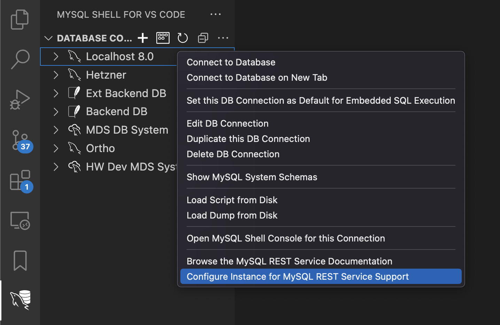
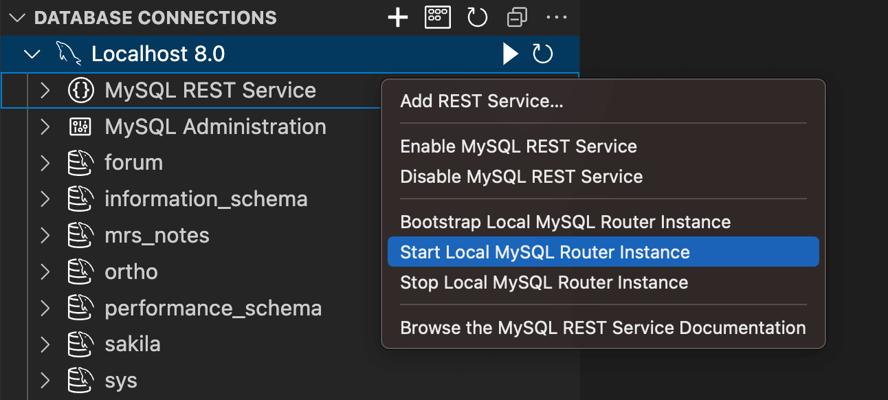

<!-- Copyright (c) 2022, 2025, Oracle and/or its affiliates.

This program is free software; you can redistribute it and/or modify
it under the terms of the GNU General Public License, version 2.0,
as published by the Free Software Foundation.

This program is designed to work with certain software (including
but not limited to OpenSSL) that is licensed under separate terms, as
designated in a particular file or component or in included license
documentation.  The authors of MySQL hereby grant you an additional
permission to link the program and your derivative works with the
separately licensed software that they have either included with
the program or referenced in the documentation.

This program is distributed in the hope that it will be useful,  but
WITHOUT ANY WARRANTY; without even the implied warranty of
MERCHANTABILITY or FITNESS FOR A PARTICULAR PURPOSE.  See
the GNU General Public License, version 2.0, for more details.

You should have received a copy of the GNU General Public License
along with this program; if not, write to the Free Software Foundation, Inc.,
51 Franklin St, Fifth Floor, Boston, MA 02110-1301 USA -->

# Configuring MySQL REST Service

To configure the MySQL REST Service (MRS), use these steps:

1. Deploy a MySQL solution.
2. [Configure](#configuring-the-mrs-metadata-schema) the MRS metadata database schema.
3. [Bootstrap](#bootstrapping-and-running-mysql-routers-with-mrs-support) and run one or more MySQL Router instances for MRS support.

After performing these steps, MySQL REST Service is fully configured.

The HTTP/S endpoints can then be accessed as configured during the MySQL Router bootstrap process.

**_Deployment of a MySQL solution_**

The following MySQL solutions are supported:

- MySQL HeatWave
- MySQL InnoDB Cluster
- MySQL InnoDB ClusterSet
- MySQL InnoDB ReplicaSet
- MySQL Operator

For development purposes, a standalone MySQL Server instance is also supported. Avoid using a standalone setup in a production deployment because it provides no form of High Availability (HA).

- Standalone MySQL Server

See the corresponding documentation about how to deploy and configure the different MySQL solutions.

## Configuring the MRS Metadata Schema

MySQL REST Service stores its configuration in the `mysql_rest_service_metadata` database schema. To deploy the metadata schema, perform one of the tasks described in this section.

Note: The MySQL user that is used to connect to the MySQL Solution must have MySQL privileges to create database schemas and roles.

### MRS Configuration Using MySQL Shell for VS Code

1. Start VS Code, install the MySQL Shell for VS Code extension, and then add a database connection to the MySQL setup.

2. Right-click the connection in the DATABASE CONNECTIONS view and select Configure Instance for MySQL REST Service Support.



The MRS metadata schema has now been configured.

### MRS Configuration Using MySQL Shell

Open a terminal, start MySQL Shell, and connect to the MySQL setup.

```bash
mysqlsh dba@localhost
```

Configure the metadata schema using the MRS plugin by executing `mrs.configure()`.

```bash
MySQL> localhost:33060+> JS> mrs.configure()
MySQL Rest Data Service configuration.

Checking MRS metadata schema and version...
Creating MRS metadata schema...
The MRS metadata is well configured, no changes performed.
```

The MRS metadata schema has now been configured.

## Bootstrapping and Running MySQL Routers with MRS Support

MySQL Router is an essential part of any MySQL solution and therefore often deployed in the same step as the MySQL Server instances. See the MySQL Router documentation for more details.

A MySQL Router instance needs to be configured to support MRS. This is usually done by using the `mysqlrouter_bootstrap` command, which queries the user account for the necessary information.

### Using MySQL Shell for VS Code to Bootstrap and Run MySQL Router

When working with a local development setup it is common to install the MySQL Router instance on the local development machine.

In this case, MySQL Shell for VS Code can be used to simplify the bootstrap process and to launch the MySQL Router instance as follows:

1. Download and install the MySQL Router package on your local development machine
   - When not using the DMG on macOS or MSI package on Windows to install MySQL Router, be sure that the directory containing the MySQL Router binaries is in the system PATH.
2. Inside MySQL Shell for VS Code,  expand a DB Connection in the DATABASE CONNECTIONS view, right-click the `MySQL REST Service` tree item,  and then select `Start Local MySQL Router Instance`.
   - If the MySQL Router has not been configured yet, the bootstrap operation runs in an integrated VS Code terminal and then starts MySQL Router.
   - MySQL Router debug output can then be inspected in the VS Code terminal.
3. To shut down MySQL Router, set the focus to the VS Code terminal showing the debug output and press `Ctrl` + `C.`

Note: The previous task only works for classic MySQL connections that are not using the MySQL SSH tunneling or MDS tunneling feature.



After the MySQL Router has been bootstrapped and started, MRS is available at `https://localhost:8443/<service-name>`.
You can then proceed and [add a REST service](#adding-rest-services-and-database-objects).


### Bootstrapping MySQL Router From the Command Line

When deploying a new MySQL Router instance, it is advised to use the `mysqlrouter_bootstrap` command to bootstrap and configure the router, including the MRS configuration. This is also true for reconfiguring an existing MySQL Router instance for MRS support.

```bash
mysqlrouter_bootstrap dba@127.0.0.1:3306 --mrs --directory ~/.mysqlrouter
```

Follow the interactive steps on the command line to configure the router.

**_Manual Creation of MySQL User Account for MySQL Router Access_**

When using the `mysqlrouter_bootstrap` command to configure MySQL Router for MRS, access the user accounts described in this section can be created automatically.

If you want to manage the required MySQL accounts manually, the following steps need to be performed:

1. Create the MySQL user account(or accounts)
   - If only one account is specified, MySQL Router uses it to access both the MRS metadata schema and application schema data. This account must have the `mysql_rest_service_meta_provider` and `mysql_rest_service_data_provider` roles.
   - If two accounts are used, MySQL Router, uses one for the MRS metadata schema access and the other one for the application schema data. Assign the `mysql_rest_service_meta_provider` role to one user and `mysql_rest_service_data_provider` to the other.
2. Bootstrap the MySQL Routers instance using the created MySQL accounts with the following options:
   - `--mrs-mysql-metadata-account` used by the router to access the MRS metadata schema
   - `--mrs-mysql-data-account` used by the router to access the application schema

As part of the MRS metadata schema creation, two SQL ROLEs have been created for MySQL Router to access MySQL:

- The 'mysql_rest_service_meta_provider' ROLE grants access to the required MRS metadata schema tables.
- The 'mysql_rest_service_data_provider' ROLE grants access to the served schema objects in the application database schemas.

To create the MySQL account, connect to the MySQL setup with MySQL Shell or MySQL Shell for VS Code and execute the following SQL statements:

```sql
CREATE USER 'mysqlrouter_mrs_<router_name>'@'<router_host>' IDENTIFIED BY 'password';
GRANT 'mysql_rest_service_meta_provider', 'mysql_rest_service_data_provider' TO 'mysqlrouter_mrs_<router_name>'@'<router_host>';
```

The user name specified for the account can then be used when calling the `mysqlrouter_bootstrap` command.

| Option | Description
| --- | ----- |
| `--mrs-mysql-metadata-account=USER_NAME` | Setting the MRS metadata user |
| `--mrs-mysql-data-account=USER_NAME` | Setting the MRS data user |

**_Adding a MRS Configuration to an Existing MySQL Router Configuration_**

In case your MySQL Router instances are configured already, it is possible to add the MRS configuration later on.

To get the path of the existing configuration file, execute `mysqlrouter --help` to show the exact location of the router config file.

The following is an example when connecting to a single development server.

```cnf
[DEFAULT]
logging_folder = /var/log/mysqlrouter
runtime_folder = /var/run/mysqlrouter
config_folder = /etc/mysqlrouter

[logger]
level = DEBUG

[routing:mrs_rw]
bind_address=0.0.0.0
bind_port=6446
destinations=10.0.1.135:3306
routing_strategy=round-robin
protocol=classic
```

To enable MRS support on the router, the configuration file needs to be extended with the [http_server] section and the [rest_mrs] section.

It is advised to use the `mysqlrouter_bootstrap` command to configure the router for MRS.

```bash
mysqlrouter_bootstrap dba@127.0.0.1:13000 --mrs --directory /export/mysql/src/mysql-trunk/boot
```

These parameters can be used to set the MRS configuration options.

| Option | Description
| --- | ----- |
| `--mrs` | Include MRS configuration |
| `--mrs-mysql-metadata-account=USER_NAME` | Setting the MRS metadata user |
| `--mrs-mysql-data-account=USER_NAME` | Setting the MRS data user |
| `--mrs-global-secret=SECRET` | The global JWT secret that must be the same for every MySQL Router installation |

The following example demonstrates connecting to a single development server and serving the REST services using HTTP.

```cnf
[http_server]
port=8443
ssl=1
ssl_cert=/Users/myUser/.mysqlsh/plugin_data/gui_plugin/web_certs/server.crt
ssl_key=/Users/myUser/.mysqlsh/plugin_data/gui_plugin/web_certs/server.key

[mysql_rest_service]
mysql_read_only_route=bootstrap_ro
mysql_read_write_route=bootstrap_rw
mysql_user=mysql_router_mrs16_250ho3u15n
mysql_user_data_access=
router_id=16
```
