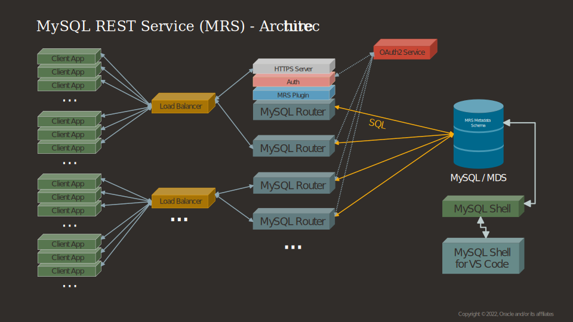

<!-- Copyright (c) 2022, 2023, Oracle and/or its affiliates.

This program is free software; you can redistribute it and/or modify
it under the terms of the GNU General Public License, version 2.0,
as published by the Free Software Foundation.

This program is also distributed with certain software (including
but not limited to OpenSSL) that is licensed under separate terms, as
designated in a particular file or component or in included license
documentation.  The authors of MySQL hereby grant you an additional
permission to link the program and your derivative works with the
separately licensed software that they have included with MySQL.
This program is distributed in the hope that it will be useful,  but
WITHOUT ANY WARRANTY; without even the implied warranty of
MERCHANTABILITY or FITNESS FOR A PARTICULAR PURPOSE.  See
the GNU General Public License, version 2.0, for more details.

You should have received a copy of the GNU General Public License
along with this program; if not, write to the Free Software Foundation, Inc.,
51 Franklin St, Fifth Floor, Boston, MA 02110-1301 USA -->

# Deployment Architecture

MySQL REST Service (MRS) can be deployed in many different ways depending on the individual project requirements.

**_Deployments for Development_**

The smallest possible development environment consists of a single MySQL Server instance and a MySQL Router instance running on the same machine.

The recommended deployment for development consists of an InnoDB Cluster deployed with a minimum of three MySQL Server instances and two MySQL Router instances.

For cloud-based development, a MySQL Database Service instance with the high availability feature enabled and two compute instances with MySQL Router deployments should be used.

**_Production Deployments_**

In a production environment, an InnoDB Cluster set up with three or more MySQL Router instances should be used. It is recommended to use a load balancer to expose the HTTPS port of the MySQL Router instances to the public internet.

For cloud-based development in production, a MySQL Database Service instance with the high availability feature enabled and three or more compute instances with MySQL Router deployments should be used. It is recommended to use a load balancer to expose the HTTPS port of the MySQL Routers to the public internet.

