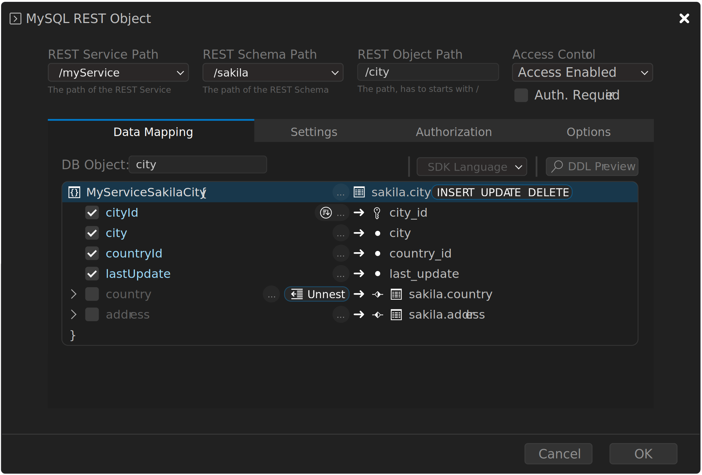

<!-- Copyright (c) 2022, 2025, Oracle and/or its affiliates.

This program is free software; you can redistribute it and/or modify
it under the terms of the GNU General Public License, version 2.0,
as published by the Free Software Foundation.

This program is designed to work with certain software (including
but not limited to OpenSSL) that is licensed under separate terms, as
designated in a particular file or component or in included license
documentation.  The authors of MySQL hereby grant you an additional
permission to link the program and your derivative works with the
separately licensed software that they have either included with
the program or referenced in the documentation.

This program is distributed in the hope that it will be useful,  but
WITHOUT ANY WARRANTY; without even the implied warranty of
MERCHANTABILITY or FITNESS FOR A PARTICULAR PURPOSE.  See
the GNU General Public License, version 2.0, for more details.

You should have received a copy of the GNU General Public License
along with this program; if not, write to the Free Software Foundation, Inc.,
51 Franklin St, Fifth Floor, Boston, MA 02110-1301 USA -->

# MRS Dialog Reference

This section discusses the individual MRS UI dialogs offered by MySQL Shell for VS Code.

## MRS Service Dialog

### REST Service Properties

Each REST service has a common set of properties.

| Option | Description |
| --- | ----- |
| MRS Service Path | The URL context root of this service |
| Comments | Comments to describe this service |
| Host Name | If specified, only requests for this host are served |
| Supported Protocols | The supported protocols (HTTPS by default) |
| Enabled | Specifies if the service is served by MySQL Router |
| Options | Advanced options in JSON format |

### REST Service Advanced Options

The following advanced options can be set in JSON format:

- headers: Accepts a JSON object with one or more HTTP header names as key and its setting as value.
- http:
  - allowedOrigin: If set to `auto`, MySQL Router dynamically sets the header `Access-Control-Allow-Origin` to the domain generating the request. Alternatively, this can be set to a specific domain `https://example.com` or a list of domains (for example, `["https://example.com", "https://example.net"]`).
- logging:
  - exceptions: If set to `true`, exceptions are logged.
  - requests:
    - body: If set to `true`, the full body of all requests are logged.
    - headers: If set to `true,` only the headers of all requests are logged.
  - response:
    - body: If set to `true`, the full body of all responses are logged.
    - headers: If set to `true`, only the headers of all responses are logged.
  - returnInternalErrorDetails: If set to `true`, the cause errors with code 500 are sent to the client.
  - includeLinksInResults: If set to `false``, the results do not include navigation links.

#### Default REST Service Options

The example that follows shows the options that are used as default when deploying a new service.

Note: These options are only recommended for development and must be changed for use in production.

By setting `allowedOrigin` to `auto` MySQL Router dynamically sets the header `Access-Control-Allow-Origin` to the domain that generates the request. This is done to work around Cross-origin resource sharing (CORS) checks of web browsers during development time.

```json
{
    "headers": {
        "Access-Control-Allow-Credentials": "true",
        "Access-Control-Allow-Headers": "Content-Type, Authorization, X-Requested-With, Origin, X-Auth-Token",
        "Access-Control-Allow-Methods": "GET, POST, PUT, DELETE, OPTIONS"
    },
    "http": {
        "allowedOrigin": "auto"
    },
    "logging": {
        "exceptions": true,
        "request": {
            "body": true,
            "headers": true
        },
        "response": {
            "body": true,
            "headers": true
        }
    },
    "returnInternalErrorDetails": true
}
```

When deploying a REST service in production, the following settings need to be changed:

1. Change `allowedOrigin` to the domain, or domains, the REST service is running on (for example,  `"https://mydomain.com"` when deploying on a production server).
2. Set `returnInternalErrorDetails` to `false`.
3. Adjust the logging settings as needed.

## MRS Schema Dialog

### REST Schema Properties

Each REST schema has a common set of properties.

| Option | Description |
| --- | ----- |
| MRS Service Path | The path of the REST service for this REST schema |
| Comments | Comments to describe this MRS schema |
| REST Schema Path | The request path to access the schema (must start with /) |
| Schema Name | The name of the corresponding database schema |
| Items per Page | The default number of items to be returned when requesting REST objects of this schema |
| Enabled | Whether or not the REST objects of this REST schema are exposed through the REST interface |
| Requires Authentication | Whether or not authentication is required to access the REST objects of this REST schema |
| Options | Additional options in JSON format |

## MRS Object Dialog

The following aspects can be set through the dialog.

- Basic Settings
  - The database schema object that should be exposed via MRS
  - The URL path of how to access the REST object
- Security
  - Whether the object is publicly available or requires authentication
  - The CRUD operations that are allowed
  - The CRUD operations that are allowed on referenced tables
  - Whether row ownership should be enforced to enable row level security
- Data Mapping
  - Which columns of the database schema object should be exposed and how they should be named
  - Which referenced tables should be included, either nested or unnested or reduced to a single field


