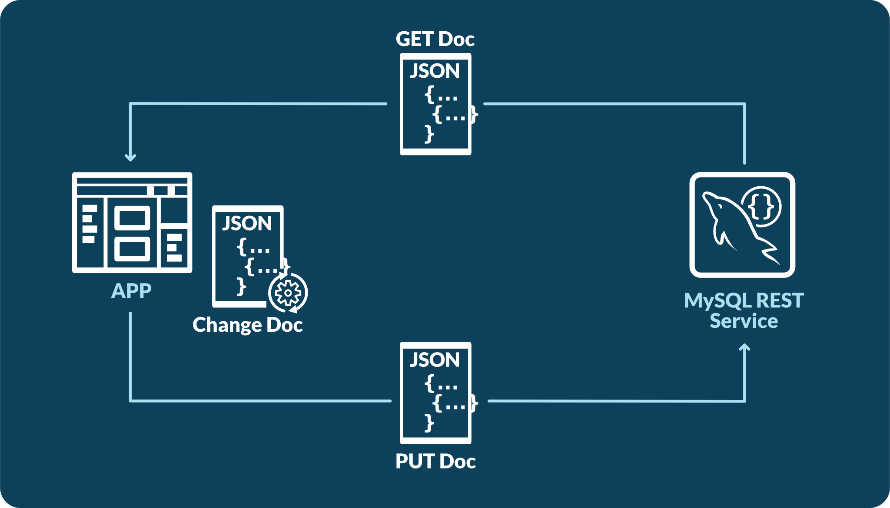
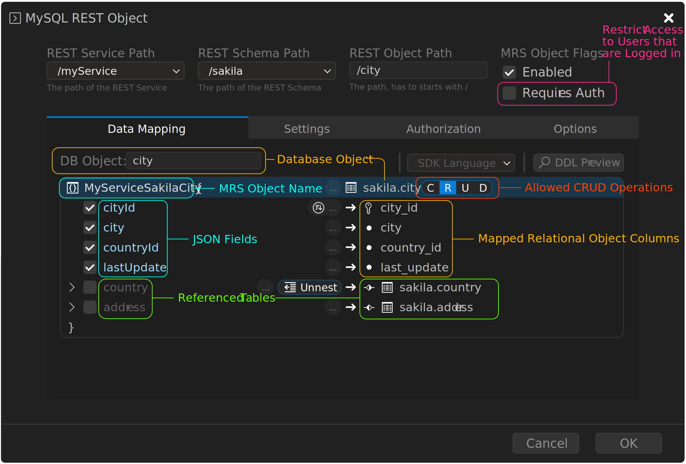

<!-- Copyright (c) 2022, 2024, Oracle and/or its affiliates.

This program is free software; you can redistribute it and/or modify
it under the terms of the GNU General Public License, version 2.0,
as published by the Free Software Foundation.

This program is designed to work with certain software (including
but not limited to OpenSSL) that is licensed under separate terms, as
designated in a particular file or component or in included license
documentation.  The authors of MySQL hereby grant you an additional
permission to link the program and your derivative works with the
separately licensed software that they have either included with
the program or referenced in the documentation.

This program is distributed in the hope that it will be useful,  but
WITHOUT ANY WARRANTY; without even the implied warranty of
MERCHANTABILITY or FITNESS FOR A PARTICULAR PURPOSE.  See
the GNU General Public License, version 2.0, for more details.

You should have received a copy of the GNU General Public License
along with this program; if not, write to the Free Software Foundation, Inc.,
51 Franklin St, Fifth Floor, Boston, MA 02110-1301 USA -->

# REST Data Mapping Views

## Introduction to REST Data Mapping Views

REST data mapping views combine the advantages of relational schemas with the ease-of-use of document databases. They give your data a conceptual and an operational duality as it is organized both relationally and hierarchically. You can base different REST data mapping views on data stored in one or more of the same tables, providing different JSON hierarchies over the same, shared data. This means that applications can access (create, query, modify) the same data as a collection of JSON documents or as a set of related tables and columns, and both approaches can be employed at the same time.

### Use Cases

The MySQL REST Service offers full support for REST data mapping views. They are used to cover both, the relational use case (1) as well as the document centric use case (2).

1. Make a single relational table or view available via a REST endpoint
    - Exposes the rows of a table as a set of **flat** JSON documents
    - Allows the application to use a traditional relational approach when needed
2. Create a single REST endpoint for a set of related database schema tables
    - Exposes the related tables as **nested** JSON objects inside a set of JSON documents
    - Allows the application to take an document oriented approach

The following figure visualizes these two use cases.


### REST Data Mapping View Workflow

The REST data mapping views can be created using the [CREATE REST DATA MAPPING VIEW](sql.html#create-rest-view) MRS DDL statement or [interactively using the MRS Object Dialog](#interactive-rest-view-design) of the MySQL Shell for VS Code extension.

Once a REST data mapping view has been created, it is extremely simple to access it using REST. The following workflow applies.

- GET a document from the REST data mapping view
- Make any changes needed to the document, including changes to the nested JSON objects
- PUT the document back into the REST data mapping view

The next figure shows a typical JSON document update cycle.



The database automatically detects the changes in the new document and modifies the underlying rows, including all nested tables. All REST data mapping views that share the same data immediately reflect this change. This drastically simplifies application development since developers no longer have to worry about inconsistencies, compared to using traditional document databases.

## Lock-Free Optimistic Concurrency Control

REST data mapping views can be safely updated concurrently without the use of locks. Objects fetched from the database have a checksum computed, which is called ETag and is included in the returned object, in the `_metadata.etag` field.

When that object is submitted back to MRS to be updated (via PUT), the ETag of the original object is compared to the current version of the ETag. If the rows corresponding to the object have changed since it was first fetched, the ETag would not match. In that case, the request fails with HTTP status code 412. The client must then fetch the object again and re-submit its update request based on an up-to-date version of the object.

The object checksum includes all fields of the source row as well as any rows joined/included, even filtered fields. Fields can be explicitly excluded using the `@nocheck` attribute.

**_Example_**

If at first, `GET /myService/sakila/city/1` returns the following JSON document to the client.

```json
{
    "city": "A Corua (La Corua)",
    "links": [
        {
            "rel": "self",
            "href": "/myService/sakila/city/1"
        }
    ],
    "cityId": 1,
    "country": {
        "country": "Spain",
        "countryId": 87,
        "lastUpdate": "2006-02-15 04:44:00.000000"
    },
    "countryId": 87,
    "lastUpdate": "2006-02-15 04:45:25.000000",
    "_metadata": {
        "etag": "FFA2187AD4B98DF48EC40B3E807E0561A71D02C2F4F5A3B953AA6CB6E41CAD16"
    }
}
```

Next, the client updates the object and changes the city name to `A Coruña (La Coruña)` and submits it by calling `PUT /myService/sakila/city/1`.

```json
{
    "city": "A Coruña (La Coruña)",
    "links": [
        {
            "rel": "self",
            "href": "/myService/sakila/city/1"
        }
    ],
    "cityId": 1,
    "country": {
        "country": "Spain",
        "countryId": 87,
        "lastUpdate": "2006-02-15 04:44:00.000000"
    },
    "countryId": 87,
    "lastUpdate": "2006-02-15 04:45:25.000000",
    "_metadata": {
        "etag": "FFA2187AD4B98DF48EC40B3E807E0561A71D02C2F4F5A3B953AA6CB6E41CAD16"
    }
}
```

If the target object has been changed (e.g. by another user) between the `GET` and the `PUT` requests, the ETag check would fail and the PUT would result in error `412 Precondition Failed`.

## Interactive REST View Design

While REST data mapping views can be created by manually writing [CREATE REST DATA MAPPING VIEW](sql.html#create-rest-view) MRS DDL statements, it is often much easier to design REST data mapping views in a visual editor.

[MySQL Shell for VS Code](https://marketplace.visualstudio.com/items?itemName=Oracle.mysql-shell-for-vs-code) includes the MySQL REST Object dialog which features an advanced `Data Mapping` designer. Using this designer it is possible to create even complex, nested REST data mapping views within seconds.

The `DDL Preview` button allows to preview the corresponding MRS DDL statement while interactively designing the REST data mapping view.

### Building a REST Data Mapping View

Building a REST data mapping view for a single relational table (or view) is straight forward. Using MySQL Shell for VS Code to [add the database schema table](adding-a-schema-object-with-mysql-shell-for-vs-code-ui) automatically creates the corresponding REST data mapping view containing all columns of the table in a **flat** JSON object.



Adding the database schema table via VS Code is equal to calling the [CREATE REST DATA MAPPING VIEW](sql.html#create-rest-view) MRS DDL statement without a `graphQlObj` definition, which also adds all columns of the table as a **flat** JSON object.

```sql
CREATE OR REPLACE REST VIEW /city
AS `sakila`.`city`
AUTHENTICATION REQUIRED;

SHOW CREATE REST VIEW /city;
```

```txt
+-----------------------------------------------+
| CREATE REST VIEW                              |
+-----------------------------------------------+
| CREATE OR REPLACE REST VIEW /city             |
|     ON SERVICE /myTestService SCHEMA /sakila  |
|     AS sakila.city {                          |
|         cityId: city_id,                      |
|         city: city,                           |
|         countryId: country_id,                |
|         lastUpdate: last_update               |
|     }                                         |
|     AUTHENTICATION REQUIRED;                  |
+-----------------------------------------------+
```

> Note: In order to be able to access the REST object without authentication, the `Requires Auth` checkbox needs to be unchecked in the MySQL REST Object dialog or the `AUTHENTICATION NOT REQUIRED` clause needs to be added to the MRS DDL statement. This should only be done during development time or when a REST endpoint should be publicly available.

#### Enabling CRUD Operations

Since only the `READ` CRUD operation is enabled by default (see the `R` being highlighted next to the relational object), only read commands will be allowed on the REST object. To change this, toggle each `CRUD` letter (`C` - Create, `R` - Read, `U` - Update and `D` - Delete) to enable or disable the corresponding functionality in the MySQL REST Object dialog.

The same can be achieved by using annotations in the MRS DDL statement.

```sql
CREATE OR REPLACE REST VIEW /city
AS `sakila`.`city` @INSERT @UPDATE @DELETE
AUTHENTICATION REQUIRED;
```

The following table shows the mapping between CRUD operations and SQL operations.

| Letter | CRUD Operation | SQL Operation |
|---|---|---|
| C | CREATE | CREATE |
| R | READ | SELECT |
| U | UPDATE | UPDATE |
| D | DELETE | DELETE |

### Creating a Nested REST Data Mapping View

By enabling a referenced table, the columns of that table are included as a nested entry in the JSON result. Please note that this works with 1:1 and 1:n relationships.


This leads to the following result.

```
GET /myService/sakila/city/1
```

```json
{
    "city": "A Corua (La Corua)",
    "links": [
        {
            "rel": "self",
            "href": "/myService/sakila/city/1"
        }
    ],
    "cityId": 1,
    "country": {
        "country": "Spain",
        "countryId": 87,
        "lastUpdate": "2006-02-15 04:44:00.000000"
    },
    "countryId": 87,
    "lastUpdate": "2006-02-15 04:45:25.000000",
    "_metadata": {
        "etag": "FFA2187AD4B98DF48EC40B3E807E0561A71D02C2F4F5A3B953AA6CB6E41CAD16"
    }
}
```

### Creating a REST Data Mapping View with an Unnested Referenced Table

If the columns of the referenced table should be added to the level above, the `Unnest` option can be enabled.


This leads to the following result.

```
GET /myService/sakila/city/1
```

```json
{
    "city": "A Corua (La Corua)",
    "links": [
        {
            "rel": "self",
            "href": "/myService/sakila/city/1"
        }
    ],
    "cityId": 1,
    "country": "Spain",
    "countryId": 87,
    "lastUpdate": "2006-02-15 04:45:25.000000",
    "_metadata": {
        "etag": "48889BABCBBA1491D25DFE0D7A270FA3FDF8A16DA8E44E42C61759DE1F0D6E35"
    }
}
```

### Creating a REST Data Mapping View with a Reduced Referenced Table

Instead of having all columns unnested and disabling all columns that are not wanted, the `Reduce to...` dropdown can be used to select the column that should be selected for the reduce operation.


This leads to the same result as the query above.

```
GET /myService/sakila/city/1
```

```json
{
    "city": "A Corua (La Corua)",
    "links": [
        {
            "rel": "self",
            "href": "/myService/sakila/city/1"
        }
    ],
    "cityId": 1,
    "country": "Spain",
    "countryId": 87,
    "lastUpdate": "2006-02-15 04:45:25.000000",
    "_metadata": {
        "etag": "48889BABCBBA1491D25DFE0D7A270FA3FDF8A16DA8E44E42C61759DE1F0D6E35"
    }
}
```

### REST View Object Identifiers

When a REST View maps to a database table, the primary key(s) specified for that table constitute the identifier of the corresponding REST Documents. If a table has a composite primary key, the identifier is a comma-separated string with the values of each column that composes the primary key.

```sql
CREATE TABLE IF NOT EXISTS sakila.my_table (id1 INT, id2 INT, name VARCHAR(3), PRIMARY KEY (id1, id2));
INSERT INTO sakila.my_table VALUES (1, 1, "foo");

CREATE OR REPLACE REST VIEW /myTable
    AS `sakila`.`my_table` @UPDATE;
```

Retrieving the specific REST document can be done as follows:

```
GET /myService/sakila/myTable/1,1
```

```json
{
    "id1": 1,
    "id2": 1,
    "links": [
        {
            "rel": "self",
            "href": "/myService/sakila/myTable/1,1"
        }
    ],
    "name": "foo",
    "_metadata": {
        "etag": "48819BABCBBA1491DBBDFE0D7A270FA3FDF8A16DA8E44E42C61759DE1F0D6A38"
    }
}
```

Updating a specific REST document can be done as follows:

```
PUT /myService/sakila/myTable/1,1
{
    "id1": 1,
    "id2": 2,
    "name": "bar"
}
```

```json
{
    "id1": 1,
    "id2": 1,
    "links": [
        {
            "rel": "self",
            "href": "/myService/sakila/myTable/1,1"
        }
    ],
    "name": "bar",
    "_metadata": {
        "etag": "48819BABCBBA1491DBBDFE0D7A270FA3FDF8A16DA8E44E4AA62559DE1F0D6A42"
    }
}
```

However, if a database table does not have any primary key, it is no longer possible to access or modify specific documents using the corresponding REST View. The same problem occurs for a database view, where there is no concept of a primary key. In both cases, the REST View requires an explicit mapping between its fields and the underlying database table columns that can/must be used as identifiers. In the former, it should be a direct mapping between one or more REST View fields and the corresponding table columns. In the latter, the mapping must exist for **ALL** primary key columns of every table used by the database view, which must also be included in the result set produced by that view.

For these specific scenarios, users can manually specify the REST View fields that map to their corresponding document identifiers.

```sql
CREATE TABLE IF NOT EXISTS sakila.my_table (id1 INT, id2 INT, name VARCHAR(3));

CREATE OR REPLACE REST VIEW /myTable
AS `sakila`.`my_table` @UPDATE {
    id1: id1 @KEY,
    id2: id2 @KEY,
    name: name
};
```
