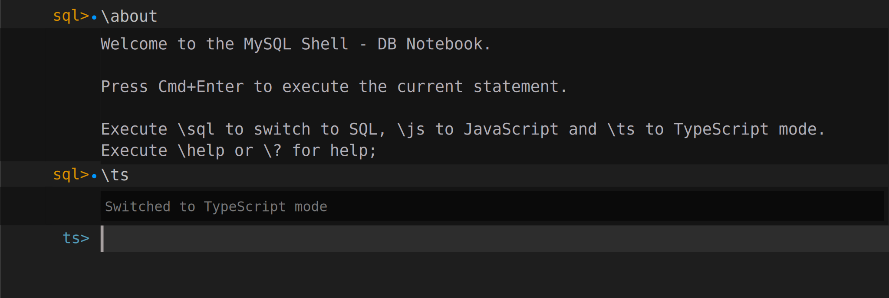
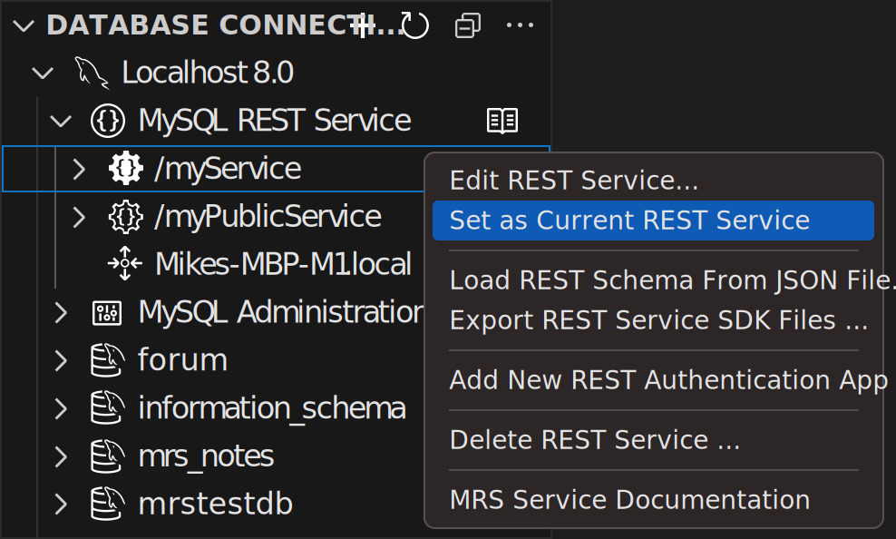

<!-- Copyright (c) 2022, 2023, Oracle and/or its affiliates.

This program is free software; you can redistribute it and/or modify
it under the terms of the GNU General Public License, version 2.0,
as published by the Free Software Foundation.

This program is also distributed with certain software (including
but not limited to OpenSSL) that is licensed under separate terms, as
designated in a particular file or component or in included license
documentation.  The authors of MySQL hereby grant you an additional
permission to link the program and your derivative works with the
separately licensed software that they have included with MySQL.
This program is distributed in the hope that it will be useful,  but
WITHOUT ANY WARRANTY; without even the implied warranty of
MERCHANTABILITY or FITNESS FOR A PARTICULAR PURPOSE.  See
the GNU General Public License, version 2.0, for more details.

You should have received a copy of the GNU General Public License
along with this program; if not, write to the Free Software Foundation, Inc.,
51 Franklin St, Fifth Floor, Boston, MA 02110-1301 USA -->

# Working Interactively with REST Services

MySQL Shell for VS Code features a live, interactive workflow for designing REST Services.

It allows developers to immediately test their newly created or modified REST duality views and REST procedures by using the MRS SDK TypeScript client API right from within a DB Notebook.

**_Preconditions for The Interactive Workflow_**

- A MySQL Router instance needs to be [bootstrapped and running with MRS support](#bootstrapping-and-running-mysql-routers-with-mrs-support). When using a local development setup it is also possible to do this [directly from within VS Code](#using-mysql-shell-for-vs-code-to-bootstrap-and-run-mysql-router).

## Switching to TypeScript Mode

After opening a database connection in MySQL Shell for VS Code the DB Notebook will be displayed. Switch the DB Notebook to TypeScript mode with `\ts` if it is in SQL mode.



## Choosing a REST Service

In order to work with a REST service on a DB Notebook it needs to be set as `current` REST Service. This is similar to executing a SQL `USE db_name` statement to set the `current` database schema.

To get information about the current REST service use the global `mrs` object and execute the `mrs.getStatus()` function. It will print information about the MRS status. The current REST service has the property `isCurrent` set to `true`.

**_Example_**

```ts
ts> mrs.getStatus();
{
    "configured": true,
    "info": "2 REST services available.",
    "services": [
        {
            "serviceName": "myService",
            "url": "https://localhost:8443/myService",
            "isCurrent": true
        },
        {
            "serviceName": "myPublicService",
            "url": "https://localhost:8443/myPublicService",
            "isCurrent": false
        }
    ]
}
```

Once a current REST service is set, the [MRS TypeScript Client API](sdk.html) for this service is automatically generated on-the-fly and made available to TypeScript code blocks on the DB Notebooks.

The current REST service object be directly accessed via a global variable using the same name as listed by the `mrs.getStatus()` function in the `serviceName` property. The `serviceName` is directly derived from the REST service's `url context root` path by converting it to `camel case` and removing all slashes `/`. E.g. a REST service with the `url context root` of `/myService` will be accessible as `myService`.

**_Example_**

```ts
ts> myService.url;
https://localhost:8443/myService
```

The current REST service can either be set from a DB Notebook via a TypeScript or through the VS Code UI.

### Using Typescript to Setting the Current REST Service

The global `mrs` object automatically holds properties for all available REST services. The naming of the REST service properties matches the `serviceName` of each REST service as discussed in the previous section.

Execute the `mrs.<serviceName>.setAsCurrent()` function to make the given REST service the current one. The VS Code auto-completion feature will assist with selecting the `serviceName`.

**_Example_**

```TypeScript
ts> mrs.myPublicService.setAsCurrent();
```

> Note: The current REST service is only available after executing the full TypeScript code block with `[command] + [Return]` on macOS and `[Ctrl] + [Return]` on Linux and Windows. It uses an async message pipeline which cannot be awaited. For that reason, trying to access specific methods of the current REST service will not work in the same code block where it was changed.

### Using VS Code to Setting the Current REST Service

Browse the `DATABASE CONNECTIONS` View in VS Code's `Primary Sidebar`, open the current DB Connection as well as the `MySQL REST Service` tree items and right click onto the desired MRS service and select `Set as Current REST Service` from the context menu.



The current REST service is indicated by a solid, filled REST service icon. All other REST services use an icon with outlines only.

## Authentication

If some of the REST objects require authentication and a REST Authentication App has been added to the REST service, use the `authenticate()` function of the REST service Client API object. This will show an login dialog where the credentials of a user account can be specified.

```ts
ts> myService.authenticate();
```

> The `authenticate()` function only works with the built in MRS authentication vendor. Please make sure to set this vendor when adding the REST Authentication App.

## Querying a REST Object

In the following examples case the `sakila.city` database table was used, as can be seen in the screenshot above.

```ts
ts> myService.sakila.city.findFirst();
{
   "city": "A Corua (La Corua)",
   "links": [
      {
         "rel": "self",
         "href": "/myService/sakila/city/1"
      }
   ],
   "cityId": 1,
   "countryId": 87,
   "lastUpdate": "2006-02-15 04:45:25.000000",
   "_metadata": {
      "etag": "EE93452B41984F3F5BBB0395CCB2CED00F5C748FEEA4A36CCD749CC3F85B7CEA"
   }
}
```

The fields can be filtered and a conditional `where` clause can be added. Please refer to the [MRS SDK Client API](sdk.html) documentation for more information.

```ts
ts> myService.sakila.city.findMany({select: ["city", "cityId"], where: {city: {$like: "NE%"}}});
{
    "items": [
        {
            "city": "Newcastle",
            "links": [
                {
                    "rel": "self",
                    "href": "/myService/sakila/city/364"
                }
            ],
            "cityId": 364,
            "_metadata": {}
        },
        {
            "city": "Nezahualcyotl",
            "links": [
                {
                    "rel": "self",
                    "href": "/myService/sakila/city/365"
                }
            ],
            "cityId": 365,
            "_metadata": {
                "etag": "681C34301F6ED6FD1200505C9C2CFB90E3367A267B7AADBD85186D781FEC7C19"
            }
        }
    ],
    "limit": 25,
    "offset": 0,
    "hasMore": false,
    "count": 2,
    "links": [
        {
            "rel": "self",
            "href": "/myService/sakila/city/"
        }
    ]
}
```

To quickly edit a REST DB Object using the [REST Object dialog](#mrs-object-dialog), the `edit()` function can be used. Please note that this function is only available on DB Notebooks.

```ts
ts> myService.sakila.city.edit()
```
