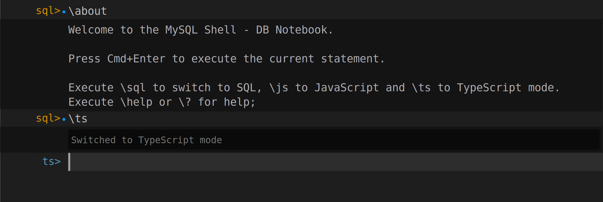

<!-- Copyright (c) 2022, 2025, Oracle and/or its affiliates.

This program is free software; you can redistribute it and/or modify
it under the terms of the GNU General Public License, version 2.0,
as published by the Free Software Foundation.

This program is designed to work with certain software (including
but not limited to OpenSSL) that is licensed under separate terms, as
designated in a particular file or component or in included license
documentation.  The authors of MySQL hereby grant you an additional
permission to link the program and your derivative works with the
separately licensed software that they have either included with
the program or referenced in the documentation.

This program is distributed in the hope that it will be useful,  but
WITHOUT ANY WARRANTY; without even the implied warranty of
MERCHANTABILITY or FITNESS FOR A PARTICULAR PURPOSE.  See
the GNU General Public License, version 2.0, for more details.

You should have received a copy of the GNU General Public License
along with this program; if not, write to the Free Software Foundation, Inc.,
51 Franklin St, Fifth Floor, Boston, MA 02110-1301 USA -->

# Accessing REST Endpoints

A MySQL Router instance must be used to access any REST endpoint. When developing on a REST service, please make sure to deploy a [MySQL Router in development mode](#deploying-a-mysql-router-for-development).

## Web Browser Access

To access a REST endpoint, expand the REST service entry in the `DATABASE CONNECTIONS` tree view until you reach the REST object. Right-click on `city` REST endpoint and select `Open REST Object Request Path in Web Browser` from the popup menu.

This will open up a web browser pointing at the REST endpoint URL `https://localhost:8443/myService/sakila/city` and display the JSON document returned from accessing the REST endpoint via the GET method.

> The port number of the URL depends on the internal ID of the DB Connection and is different for each connection.

```JSON
{
    "items": [
        {
            "city": "A Coruña (La Coruña)",
            "links": [
                {
                    "rel": "self",
                    "href": "/myService/sakila/city/1"
                }
            ],
            "cityId": 1,
            "countryId": 87,
            "lastUpdate": "2006-02-15 04:45:25.000000",
            "_metadata": {
                "etag": "09785343A8A790724C995E20AE6844EA2A78E9CFD57BE64063B2FC56E12D8FFC"
            }
        },
        {
            "city": "Abha",
            "links": [
                {
                    "rel": "self",
                    "href": "/myService/sakila/city/2"
                }
            ],
            "cityId": 2,
            "countryId": 82,
            "lastUpdate": "2006-02-15 04:45:25.000000",
            "_metadata": {
                "etag": "B069A2EEC4663506F97019A369BD77AB086A9BA5FB1DD224C36B67CF687A6B14"
            }
        },
        ...
    ],
    "limit": 25,
    "offset": 0,
    "hasMore": true,
    "count": 25,
    "links": [
        {
            "rel": "self",
            "href": "/myService/sakila/city/"
        },
        {
            "rel": "next",
            "href": "/myService/sakila/city/?offset=25"
        }
    ]
}
```

## TypeScript Prompt

The MySQL Shell for VS Code supports and interactive workflow to prototype REST access using TypeScript.

After opening a database connection in MySQL Shell for VS Code the DB Notebook will be displayed. Switch the DB Notebook to TypeScript mode with `\ts` if it is in SQL mode.



First, you can check the status of the MySQL REST Service by executing the `mrs.getStatus();` command. Since the automatically generated Client SDK is fully type safe, auto completion support will be provided all the way.

```ts
ts> mrs.getStatus();
{
    "configured": true,
    "info": "1 REST service available.",
    "services": [
        {
            "serviceName": "myService",
            "url": "https://localhost:8443/myService",
            "isCurrent": true
        }
    ]
}
```

Next we can do a `findFirst()` operation on the `/myService/sakila/city` endpoint to fetch the first city in the list. Again, the auto completion feature should guide the way.

```ts
ts> myService.sakila.city.findFirst();
{
    "city": "A Coruña (La Coruña)",
    "cityId": 1,
    "countryId": 87,
    "lastUpdate": "2006-02-15 04:45:25.000000"
}
```

Searching for a specific city can be done by using the `find()` method and using a where clause.

```ts
ts> myService.sakila.city.find({where: {city: { '$like': 'Van%'}}})
[
    {
        "city": "Vancouver",
        "cityId": 565,
        "countryId": 20,
        "lastUpdate": "2006-02-15 04:45:25.000000"
    }
]
```

Many more methods are available when using the Client SDK. Please see the [SDK Reference](sdk.html#sdk-cheat-sheet) for more details.

## Access via CURL

Instead of using a web browser, the REST endpoint can be accessed using any other HTTP client as well.

Using `curl` is a popular way to fetch data via HTTP from the command line. It is installed by default on MacOS machines and can easily be installed on Linux and Windows.

To access the city REST endpoint, the following can be executed on a terminal. The JSON data will be formatted using the jq tool.

```bash
curl -s "https://localhost:8443/myService/sakila/city" | jq
{
  "items": [
    {
      "city": "A Coruña (La Coruña)",
      "links": [
        {
          "rel": "self",
          "href": "/myService/sakila/city/1"
        }
      ],
      "cityId": 1,
      "countryId": 87,
      "lastUpdate": "2006-02-15 04:45:25.000000",
      "_metadata": {
        "etag": "09785343A8A790724C995E20AE6844EA2A78E9CFD57BE64063B2FC56E12D8FFC"
      }
    },
    {
      "city": "Abha",
      "links": [
        {
          "rel": "self",
          "href": "/myService/sakila/city/2"
        }
      ],
      "cityId": 2,
      "countryId": 82,
      "lastUpdate": "2006-02-15 04:45:25.000000",
      "_metadata": {
        "etag": "B069A2EEC4663506F97019A369BD77AB086A9BA5FB1DD224C36B67CF687A6B14"
      }
    },
    ...
  ],
  "limit": 25,
  "offset": 0,
  "hasMore": true,
  "count": 25,
  "links": [
    {
      "rel": "self",
      "href": "/myService/sakila/city/"
    },
    {
      "rel": "next",
      "href": "/myService/sakila/city/?offset=25"
    }
  ]
}
```

To perform a find operation we can specify the additional `q` parameter. To learn more about the core REST API syntax please browse the corresponding [Core REST APIs](restApi.html#mrs-core-rest-apis) manual.

```bash
url=https://localhost:8443/myService/sakila/city
curl -s "$url?q=$(echo '{"city":{"$like":"Van%"}}'|jq -sRr @uri)" | jq
{
  "items": [
    {
      "city": "Vancouver",
      "links": [
        {
          "rel": "self",
          "href": "/myService/sakila/city/565"
        }
      ],
      "cityId": 565,
      "countryId": 20,
      "lastUpdate": "2006-02-15 04:45:25.000000",
      "_metadata": {
        "etag": "E5162E0999E4A016B8AEA25FE6E5C79C6F171B3A207B4143C20B1D3380C6BABA"
      }
    }
  ],
  "limit": 25,
  "offset": 0,
  "hasMore": false,
  "count": 1,
  "links": [
    {
      "rel": "self",
      "href": "/myService/sakila/city/"
    }
  ]
}
```

## Deploying a Web App

The MySQL REST Service not only serves dynamic database schema data, but also static files. This feature can be used to upload a Progressive Web App (PWA) and have the MySQL Routers serve the PWA. In that case, no additional web server setup is needed.

One popular PWA is the OpenAPI Web UI (also called [SwaggerUI](https://github.com/swagger-api/swagger-ui)). It provides a user friendly interface to work with REST endpoints based on their OpenAPI definition.

To deploy a OpenAPI Web UI instance for the REST service created above, right click on the REST service item DATABASE CONNECTIONS view and select the `Deploy OpenAPI Web UI` popup menu item.

> Please note that this operation requires an internet connection that can reach `github.com`.

This will show the `MRS Content Set` dialog. Leave all settings unchanged and click the `OK` button.

The OpenAPI Web UI will now be downloaded from `github.com`, patched with a dark mode and enabling authentication with MRS. After this operation is completed, a notification will be show stating `The MRS static content set has been added successfully. 10 files have been uploaded`.

Now, navigate to the REST service item DATABASE CONNECTIONS view and right-click on the `/OpenApiUi` REST content set item. Select the `Open Content Set Request Path in Web Browser` popup menu item.

This will open the URL `https://localhost:8443/myService/openApiUi/` in a web browser and render the OpenAPI Web UI for the `/myService`, giving access to the different HTTP methods for the `/myService/sakila/city` endpoint.
