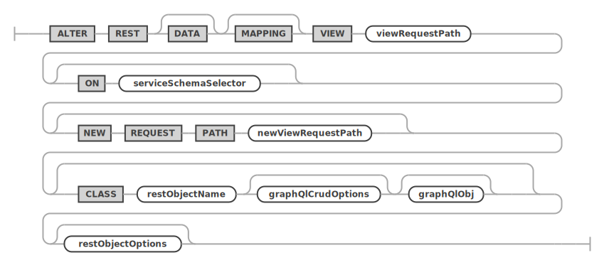

<!-- Copyright (c) 2022, 2025, Oracle and/or its affiliates.

This program is free software; you can redistribute it and/or modify
it under the terms of the GNU General Public License, version 2.0,
as published by the Free Software Foundation.

This program is designed to work with certain software (including
but not limited to OpenSSL) that is licensed under separate terms, as
designated in a particular file or component or in included license
documentation.  The authors of MySQL hereby grant you an additional
permission to link the program and your derivative works with the
separately licensed software that they have either included with
the program or referenced in the documentation.

This program is distributed in the hope that it will be useful,  but
WITHOUT ANY WARRANTY; without even the implied warranty of
MERCHANTABILITY or FITNESS FOR A PARTICULAR PURPOSE.  See
the GNU General Public License, version 2.0, for more details.

You should have received a copy of the GNU General Public License
along with this program; if not, write to the Free Software Foundation, Inc.,
51 Franklin St, Fifth Floor, Boston, MA 02110-1301 USA -->

# ALTER

## ALTER REST SERVICE

An existing REST service can be altered by using the `ALTER REST SERVICE` statement. It uses the same `restServiceOptions` as used by the [`CREATE REST SERVICE`](#create-rest-service) statement. Please see the discussion of the options [there](#create-rest-service).

**_SYNTAX_**

```antlr
alterRestServiceStatement:
    ALTER REST SERVICE serviceRequestPath (
        NEW REQUEST PATH newServiceRequestPath
    )? restServiceOptions?
;

restServiceOptions: (
        enabledDisabled
        | restAuthentication
        | jsonOptions
        | comments
        | metadata
        | addAuthApp
        | removeAuthApp
    )+
;

addAuthApp:
    ADD AUTH APP authAppName
;

removeAuthApp:
    REMOVE AUTH APP authAppName
;
```

alterRestServiceStatement ::=


restServiceOptions ::=


addAuthApp ::=


removeAuthApp ::=


**_Examples_**

The following example alters a REST service `/myService` by setting a new comment.

```sql
ALTER REST SERVICE /myService
    COMMENT "A simple, improved REST service";
```

## ALTER REST SCHEMA

An existing REST schema can be altered by using the `ALTER REST SCHEMA` statement. It uses the same `restSchemaOptions` as used by the [`CREATE REST SCHEMA`](#create-rest-schema) statement. Please see the discussion of the options there.

**_SYNTAX_**

```antlr
alterRestSchemaStatement:
    ALTER REST DATABASE schemaRequestPath? (
        ON SERVICE? serviceRequestPath
    )? (
        NEW REQUEST PATH newSchemaRequestPath
    )? (FROM schemaName)? restSchemaOptions?
;

restSchemaOptions: (
        enabledDisabledPrivate
        | authenticationRequired
        | itemsPerPage
        | jsonOptions
        | comments
        | metadata
    )+
;
```

alterRestSchemaStatement ::=


restSchemaOptions ::=


**_Examples_**

The following example alters a REST schema `/myService` to use a new request path `/myPublicService`.

```sql
ALTER REST SCHEMA /sakila ON SERVICE /myService
    NEW REQUEST PATH /myPublicService;
```

## ALTER REST VIEW

The `ALTER REST DATA MAPPING VIEW` statement is used to alter existing REST data mapping views.

Please see the corresponding [GraphQL section](#defining-the-graphql-definition-for-a-rest-view) about how to design the GraphQL definition for a REST data mapping view.

Please see the MRS Developer's Guide to learn more about [JSON data mapping views](index.html#rest-views).

**_SYNTAX_**

```antlr
alterRestViewStatement:
    ALTER REST DATA? MAPPING? VIEW
        viewRequestPath (ON serviceSchemaSelector)? (
        NEW REQUEST PATH newViewRequestPath
    )? (
        CLASS restObjectName graphQlCrudOptions? graphQlObj?
    )? restObjectOptions?
;

serviceSchemaSelector:
    (SERVICE serviceRequestPath)? DATABASE schemaRequestPath
;

restObjectOptions: (
        enabledDisabledPrivate
        | authenticationRequired
        | itemsPerPage
        | jsonOptions
        | comments
        | metadata
        | restViewMediaType
        | restViewFormat
        | restViewAuthenticationProcedure
    )+
;
```

alterRestViewStatement ::=


serviceSchemaSelector ::=


restObjectOptions ::=


**_Examples_**

The following example alters a REST data mapping view for the `sakila.city` database schema table and sets a new list of fields.

```sql
ALTER REST VIEW /city
ON SERVICE /myService SCHEMA /sakila
FROM `sakila`.`city` AS MyServiceSakilaCity {
    cityId: city_id @SORTABLE,
    city: city
};
```

## ALTER REST PROCEDURE

The `ALTER REST PROCEDURE` statement is used to alter REST endpoints for database schema stored procedures.

It uses the same [extended GraphQL syntax](#defining-the-graphql-definition-for-a-rest-view) as defined for REST data mapping views to describe the REST procedure's parameters and result sets. Please make sure to study the [corresponding section](#defining-the-graphql-definition-for-a-rest-view).

**_SYNTAX_**

```antlr
alterRestProcedureStatement:
    ALTER REST PROCEDURE procedureRequestPath (
        ON serviceSchemaSelector
    )? (
        NEW REQUEST PATH newProcedureRequestPath
    )? (PARAMETERS restObjectName? graphQlObj)? restProcedureResult* restObjectOptions?
;

serviceSchemaSelector:
    (SERVICE serviceRequestPath)? DATABASE schemaRequestPath
;

restObjectOptions: (
        enabledDisabledPrivate
        | authenticationRequired
        | itemsPerPage
        | jsonOptions
        | comments
        | metadata
        | restViewMediaType
        | restViewFormat
        | restViewAuthenticationProcedure
    )+
;
```

alterRestProcedureStatement ::=


serviceSchemaSelector ::=


restObjectOptions ::=


## ALTER REST FUNCTION

The `ALTER REST FUNCTION` statement is used to alter REST endpoints for database schema stored functions.

It uses the same [extended GraphQL syntax](#defining-the-graphql-definition-for-a-rest-view) as defined for REST data mapping views to describe the REST procedure's parameters and result sets. Please make sure to study the [corresponding section](#defining-the-graphql-definition-for-a-rest-view).

**_SYNTAX_**

```antlr
alterRestFunctionStatement:
    ALTER REST FUNCTION functionRequestPath (
        ON serviceSchemaSelector
    )? (
        NEW REQUEST PATH newFunctionRequestPath
    )? (PARAMETERS restObjectName? graphQlObj)? restFunctionResult* restObjectOptions?
;

serviceSchemaSelector:
    (SERVICE serviceRequestPath)? DATABASE schemaRequestPath
;

restObjectOptions: (
        enabledDisabledPrivate
        | authenticationRequired
        | itemsPerPage
        | jsonOptions
        | comments
        | metadata
        | restViewMediaType
        | restViewFormat
        | restViewAuthenticationProcedure
    )+
;
```

alterRestFunctionStatement ::=


serviceSchemaSelector ::=


restObjectOptions ::=


## ALTER REST CONTENT SET

The `ALTER REST CONTENT SET` statement is used to alter REST content sets.

**_SYNTAX_**

```antlr
alterRestContentSetStatement:
    ALTER REST CONTENT SET contentSetRequestPath (
        ON SERVICE? serviceRequestPath
    )? (
        NEW REQUEST PATH newContentSetRequestPath
    )? restContentSetOptions?
;
```

alterRestContentSetStatement ::=


## ALTER REST USER

Change password and options for an existing REST user account.

**_SYNTAX_**

```antlr
alterRestUserStatement:
    ALTER REST USER userName AT_SIGN authAppName (
        IDENTIFIED BY userPassword
    )? userOptions?
;
```

createRestUserStatement ::=

