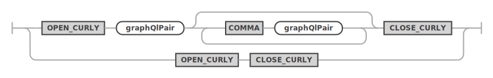
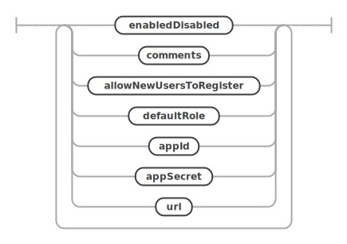

<!-- Copyright (c) 2022, 2025, Oracle and/or its affiliates.

This program is free software; you can redistribute it and/or modify
it under the terms of the GNU General Public License, version 2.0,
as published by the Free Software Foundation.

This program is designed to work with certain software (including
but not limited to OpenSSL) that is licensed under separate terms, as
designated in a particular file or component or in included license
documentation.  The authors of MySQL hereby grant you an additional
permission to link the program and your derivative works with the
separately licensed software that they have either included with
the program or referenced in the documentation.

This program is distributed in the hope that it will be useful,  but
WITHOUT ANY WARRANTY; without even the implied warranty of
MERCHANTABILITY or FITNESS FOR A PARTICULAR PURPOSE.  See
the GNU General Public License, version 2.0, for more details.

You should have received a copy of the GNU General Public License
along with this program; if not, write to the Free Software Foundation, Inc.,
51 Franklin St, Fifth Floor, Boston, MA 02110-1301 USA -->

# CONFIGURE and CREATE

## CONFIGURE REST METADATA

The CONFIGURE REST METADATA statement is used to perform the initial configuration of the MySQL REST Service on a MySQL Server instance or InnoDB Cluster/Set.

It will create the `mysql_rest_service_metadata` database schema.

Please note that the MySQL account used to execute the statement needs the required privileges to create database schemas.

**_Syntax_**

```antlr
configureRestMetadataStatement:
    CONFIGURE REST METADATA restMetadataOptions?
;

restMetadataOptions: (
        enabledDisabled
        | jsonOptions
        | updateIfAvailable
    )+
;
```

configureRestMetadataStatement ::=


restMetadataOptions ::=


**_Example_**

```sql
CONFIGURE REST METADATA;
```

### Enable or Disable the MySQL REST Service

The enabledDisabled option specifies if the MySQL REST Service should be enabled or disabled after the configuration operation. The default is set to enable the MySQL REST Service.

```antlr
enabledDisabled:
    ENABLED
    | DISABLED
;
```

enabledDisabled ::=


**_Examples_**

The following example configures the MySQL REST Service and enables it and updates the metadata schema, if possible.

```sql
CONFIGURE REST METADATA
    ENABLED
    UPDATE IF AVAILABLE;
```

The following example configures the MySQL REST Service and enables the GTID cache and sets authentication options.

```sql
CONFIGURE REST METADATA
    ENABLED
    OPTIONS {
        "gtid": {
            "cache": {
                "enable": true,
                "refresh_rate": 5,
                "refresh_when_increases_by": 500
            }
        },
        "authentication": {
            "throttling": {
                "perAccount": {
                    "minimumTimeBetweenRequestsInMs": 1500,
                    "maximumAttemptsPerMinute": 5
                },
                "perHost": {
                    "minimumTimeBetweenRequestsInMs": 1500,
                    "maximumAttemptsPerMinute": 5
                },
                "blockWhenAttemptsExceededInSeconds": 120
            }
        }
    };
```

### REST Configuration Json Options

The jsonOptions allow to set a number of specific options for the service.

```antlr
jsonOptions:
    OPTIONS jsonValue
;
```

jsonOptions ::=


These options can include the following JSON keys.

- `authentication`
  - Defines global authentication parameters valid for all MySQL Routers
  - `throttling`
    - Used to limit the authentication attempts to prevent brute force attacks on account information
    - `perAccount`
      - Settings that apply per MRS account
      - `minimumTimeBetweenRequestsInMs`
        - Sets the minimum time between connection attempts. If a client tries to authenticate faster than that the request will be rejected. The value is given in milliseconds.
      - `maximumAttemptsPerMinute`
        - Sets the maximum amount of attempts per minute. If a client tries to authenticate more often that that further attempts will be blocked for the amount of seconds specified in the `blockWhenAttemptsExceededInSeconds` value.
    - `perHost`
      - Settings that apply per host from where a client tries to connect
      - `minimumTimeBetweenRequestsInMs`
      - `maximumAttemptsPerMinute`
    - `blockWhenAttemptsExceededInSeconds`
      - Sets the amount of time the account or client host will be blocked from authentication. The value is given in seconds.
- `gtid`
  - Defines global settings for the MySQL GTID handling, using the following fields.
  - `cache`
    - Is used to configure the MySQL Router's GTID cache.
    - `enable`
      - If set to `true` GTIDs will be cached by the MySQL Router.
    - `refresh_rate`
      - Defines how often the GTID cache will be refreshed. Set seconds, e.g. 5.
    - `refresh_when_increases_by`
      - In addition to the time based refresh, the GTID cache can also be refreshed based on the number of transactions that happened since the last refresh. Set in number of transactions, e.g. 500.
- `responseCache`
  - Global options for the REST endpoint response cache, which keeps an in-memory cache of responses to GET requests on tables, views, procedures and functions. To enable caching of an endpoint, you must also set the `cacheTimeToLive` option for each object to be cached.
  - `maxCacheSize`
    - Maximum size of the cache. Default is 1M.
- `fileCache`
  - Global options for the static file data cache, which keeps an in-memory cache of responses to GET requests on content set files.
  - `maxCacheSize`
    - Maximum size of the cache. Default is 1M.
- `defaultStaticContent`
  - Allows the definition of static content for the root path `/` that will be returned for file paths matching the given JSON keys. A JSON key `index.html` will be  served as `/index.html` by the MySQL Router. The file content needs to be Base64 encoded. If the same JSON key is used for `defaultStaticContent` as well as for `defaultRedirects`, the redirect is prioritized.
- `defaultRedirects`
  - Is used to define internal redirects performed by the MySQL Router. This can be used to expose content of a REST service on the root path `/`. A JSON key `index.html` holding the value `/myService/myContentSet/index.html` will exposed the corresponding file from the given path as `/index.html`.
- `directoryIndexDirective`
  - Holds an ordered list of files that should be returned when a directory path has been requested. The first matching file that is available will be returned. The `directoryIndexDirective` is recursively applies to all directory paths exposed by the MySQL Router. To change the `directoryIndexDirective` for a given REST service or REST static content set, the corresponding option needs to be set for those objects.

All other keys will be ignored and can be used to store custom metadata about the service. It is a good practice to include a unique prefix when adding custom keys to avoid them be overwritten by future MRS options.

**_Examples_**

The following JsonValue will define the static content for `/index.html`, `/favicon.ico` and `/favicon.svg`. It will also direct the MySQL Router to return the contents of `/index.html` if the root path `/` is requested, e.g. `https://my.example.com/`

```json
{
    "defaultStaticContent": {
        "index.html": "PCFET0NUW...",
        "favicon.ico": "AAABAAMAM...",
        "favicon.svg": "PD94bWwmV..."
    },
    "directoryIndexDirective": [
        "index.html"
    ]
}
```

In this example an internal redirect of `/index.html` to `/myService/myContentSet/index.html` is performed, directly serving the `index.html` page of `/myService/myContentSet`. This overwrites the `index.html` definition in `defaultStaticContent`.

This is useful to directly serve a specific app on the root path `/`.

```json
{
    "defaultStaticContent": {
        "index.html": "PCFET0NUW...",
        "favicon.ico": "AAABAAMAM...",
        "favicon.svg": "PD94bWwmV..."
    },
    "defaultRedirects": {
        "index.html": "/myService/myContentSet/index.html"
    },
    "directoryIndexDirective": [
        "index.html"
    ]
}
```

### Updating the MySQL REST Service Metadata Schema

If the updateIfAvailable is defined, the configure operation will include an update of the `mysql_rest_service_metadata` database schema.

```antlr
updateIfAvailable:
    UPDATE (IF AVAILABLE)?
;
```

updateIfAvailable ::=


## CREATE REST SERVICE

The CREATE REST SERVICE statement is used to create a new or replace an existing REST service.

The MySQL REST Service supports the creation of many individual REST services. It is good practice to create a separate REST service for each REST application.

Each REST service can have its own options, authentication apps and supports a different set of authentication users.

Please note that service will not be published at creation time by default. They will only be served by MySQL Routers that are bootstrapped for development purposes. To publish a REST service after all REST schemas and REST objects have been created please use the [`ALTER REST SERVICE`](#alter-rest-service) statement and set the PUBLISHED option.

**_SYNTAX_**

```antlr
createRestServiceStatement:
    CREATE (OR REPLACE)? REST SERVICE serviceRequestPath
        restServiceOptions?
;

serviceRequestPath:
    serviceDevelopersIdentifier? hostAndPortIdentifier? requestPathIdentifier
;

restServiceOptions: (
        enabledDisabled
        | publishedUnpublished
        | restProtocol
        | restAuthentication
        | jsonOptions
        | comments
        | metadata
        | addAuthApp
    )+
;
```

createRestServiceStatement ::=


serviceRequestPath ::=


restServiceOptions ::=


**_Examples_**

The following example creates a REST service `/myService`. Please note that you need to set the `PUBLISHED` option to make the REST service publicly available.

```sql
CREATE OR REPLACE REST SERVICE /myService
    COMMENTS "A simple REST service";
```

The following example creates a REST service `/myTestService` that can only be accessed on localhost and is published at creation time.

```sql
CREATE OR REPLACE REST SERVICE localhost/myTestService
    PUBLISHED
    COMMENTS "A REST service that can only be accessed on localhost";
```

The next examples shows how to set the REST service options.

```sql
CREATE OR REPLACE REST SERVICE localhost/myTestService
    COMMENTS "A simple REST service"
    AUTHENTICATION
        PATH "/authentication"
        REDIRECTION DEFAULT
        VALIDATION DEFAULT
        PAGE CONTENT DEFAULT
    OPTIONS {
        "headers": {
            "Access-Control-Allow-Credentials": "true",
            "Access-Control-Allow-Headers": "Content-Type, Authorization, X-Requested-With, Origin, X-Auth-Token",
            "Access-Control-Allow-Methods": "GET, POST, PUT, DELETE, OPTIONS"
        },
        "http": {
            "allowedOrigin": "auto"
        },
        "logging": {
            "exceptions": true,
            "request": {
                "body": true,
                "headers": true
            },
            "response": {
                "body": true,
                "headers": true
            }
        },
        "returnInternalErrorDetails": true,
        "includeLinksInResults": false
    };
```

### Building a ServiceRequestPath

When creating or accessing a REST service a `serviceRequestPath` has to be specified which uniquely identifies the REST service across the MySQL REST Service.

It consists of three components.

- `serviceDevelopersIdentifier` (optional) - When set, the REST service is only available to the developers listed.
- `hostAndPortIdentifier` (optional) - When set, the access to the REST service is limited to the given host and port.
- `requestPathIdentifier` - The URL context root path the REST service will be served from.

In many cases setting the `requestPathIdentifier` will be sufficient.

The `hostAndPortIdentifier` only needs to be set if a REST service should only be made available through access via a specific host, like `localhost` when the MySQL Router is co-located with the client application.

The `serviceDevelopersIdentifier` will be set automatically when a REST service is cloned for development by a given developer. Should such a REST service be made available to more developers, the list of developers can be extended via an [`ALTER REST SERVICE`](#alter-rest-service) command.

```antlr
serviceDevelopersIdentifier:
    serviceDeveloperIdentifier (
        COMMA serviceDeveloperIdentifier
    )* AT_SIGN?
;

hostAndPortIdentifier: (
        (dottedIdentifier | AT_TEXT_SUFFIX) (
            COLON INT_NUMBER
        )?
    )
;

requestPathIdentifier:
    DIV_OPERATOR dottedIdentifier (DIV_OPERATOR dottedIdentifier)?
;
```

serviceDevelopersIdentifier ::=


hostAndPortIdentifier ::=


requestPathIdentifier ::=


### Enabling or Disabling a REST Service at Creation Time

The `enabledDisabled` option specifies whether the REST service should be enabled or disabled. REST services are created in the ENABLED state by default. The state can be changed via the [`ALTER REST SERVICE`](#alter-rest-service) statement.

Please also see the `publishedUnpublished` option which determines if a REST service is served by MySQL Routers.

```antlr
enabledDisabled:
    ENABLED
    | DISABLED
;
```

enabledDisabled ::=


### Publishing a REST Service at Creation Time

The `publishedUnpublished` option specifies whether the REST service should be in `PUBLISHED` or `UNPUBLISHED` state. REST services are created in the `UNPUBLISHED` state by default.

A REST service in `UNPUBLISHED` state will only be served by MySQL Routers that are bootstrapped for development using the `--mrs-development <user>` option. To make a REST service publicly available on all MySQL Routers it needs to be set to the `PUBLISHED` state using the [`ALTER REST SERVICE`](#alter-rest-service) statement.

```antlr
publishedUnpublished:
    PUBLISHED
    | UNPUBLISHED
;
```

publishedUnpublished ::=


### Setting the REST Service Protocol

In general it is advised to run the MySQL REST Service using HTTPS only and changing the REST service protocol default (HTTPS) is not required.

There might still be special use cases when configuring the MySQL Router using HTTP is acceptable, e.g. when using a reverse proxy on the same machine that is handling the HTTPS part and not using MySQL internal authentication which requires passwords to be transferred in plain text. But even in that specific example the REST service protocol must be set to HTTPS as the reverse proxy offers the REST service via HTTPS.

Should there still be a configuration setup that requires the REST service to be accessible by clients via HTTP, the REST service protocol can be switched to HTTP.

This setting is used in two places.

- When specifying a `hostAndPortIdentifier` to limit accepted connections to requests to this host and port, the protocol setting is used to build fully qualified URLs in the link section of JSON results.
- When performing an OAuth2 authentication request, the protocol is used to build the redirect URL parameter in the first authentication request to the OAuth2 server. The protocol used in the redirect URL parameter must match the external protocol the REST service is reachable on. In case of using a reverse proxy, the `X-Forwarded-Proto` request header will overwrite this setting when made available by the proxy.

```antlr
restProtocol:
    PROTOCOL (
        HTTP
        | HTTPS
    )
;
```

### Assigning a REST Authentication App to a REST Service

To enable authentication for a REST service, a REST authentication app needs to be linked to the REST service. REST authentication apps are created using the [CREATE REST AUTH APP](#create-rest-auth-app) statement.

REST authentication apps can be linked while creating the REST service or they can be added alter using the [ALTER REST SERVICE](#alter-rest-service) statement.

```antlr
addAuthApp:
    ADD AUTH APP authAppName
;
```

addAuthApp ::=


### REST Service Authentication Settings

Each REST service can be configured with specific authentication settings.

```antlr
restAuthentication:
    AUTHENTICATION (
        authPath
        | authRedirection
        | authValidation
        | authPageContent
    )*
;

authPath:
    PATH quotedTextOrDefault
;

authRedirection:
    REDIRECTION quotedTextOrDefault
;

authValidation:
    VALIDATION quotedTextOrDefault
;

authPageContent:
    PAGE CONTENT quotedTextOrDefault
;
```

restAuthentication ::=


authPath ::=


authRedirection ::=


authValidation ::=


authPageContent ::=


- AUTHENTICATION PATH
  - The html path used for authentication handling for this REST service. Specified as a sub-path to the REST service path. If not explicitly set, the default is path is `/authentication` is used.
  - The following endpoints will be made available for `<service_path>/<auth_path>`
    - `/login`
    - `/status`
    - `/logout`
    - `/completed`
- AUTHENTICATION REDIRECTION
  - The authentication workflow will redirect to this URL after successful- or failed login. Specified as a sub-path to the REST service path. If this option is not set explicitly, the workflow will redirect to `<service_path>/<auth_path>/completed` if the `<service_path>/<auth_path>/login?onCompletionRedirect` parameter has not been set.
- AUTHENTICATION VALIDATION
  - A regular expression to validate the `<service_path>/<auth_path>/login?onCompletionRedirect` parameter. If set, this allows to limit the possible URLs an application can specify for this parameter.
- AUTHENTICATION PAGE CONTENT
  - If this option is set its content will replace the page content of the `<service_path>/<auth_path>/completed` page.

### REST Service Json Options

The jsonOptions allow to set a number of specific options for the service.

```antlr
jsonOptions:
    OPTIONS jsonValue
;
```

jsonOptions ::=


These options can include the following JSON keys.

- `headers` - Allows the specification of HTTP headers. Please refer to the HTTP header documentation for details.
- `http`
  - `allowedOrigin` - The setting for Access-Control-Allow-Origin HTTP header. Can either be set to `*`, `null`, `<origin>` or `auto`. When set to `auto`, the MySQL Routers will return the origin of the specific client making the request.
- `httpMethodsAllowedForUnauthorizedAccess` - If a REST objects is configured to not require authentication, only GET is allowed by default. In a testing environment it might be desirable to allow all HTTP methods. In that case this option can be set to a list of allowed methods, e.g. ["GET", "POST", "PUT", "DELETE"]
- `logging`
  - `exceptions` - If exceptions should be logged.
  - `requests`
    - `body` - If the content of request bodies should be logged.
    - `headers` - If the content of request headers should be logged.
  - `response`
    - `body` - If the content of response bodies should be logged.
    - `headers` - If the content of response headers should be logged.
- `returnInternalErrorDetails` - If internal errors should be returned. This is useful for application development but should be turned off for production deployments.
- `includeLinksInResults` - If set to false, the results do not include navigation links.
- `defaultStaticContent` - Allows the definition of static content for `request path` of the REST service that will be returned for file paths matching the given JSON keys. A JSON key `index.html` will be served as `/myService/index.html` by the MySQL Router if the `request path` of the REST service has been set to `/myService`. The file content needs to be Base64 encoded. If the same JSON key is used for `defaultStaticContent` as well as for `defaultRedirects`, the redirect is prioritized.
- `defaultRedirects` - Is used to define internal redirects performed by the MySQL Router. This can be used to expose content on the `request path` of the of a REST service. A JSON key `index.html` holding the value `/myService/myContentSet/index.html` will exposed the corresponding file from the given path as `/myService/index.html` if the `request path` of the REST service has been set to `/myService`.
- `directoryIndexDirective` - Holds an ordered list of files that should be returned when a directory path has been requested. The first matching file that is available will be returned. The `directoryIndexDirective` is recursively applies to all directory paths exposed by the MySQL Router. To change the `directoryIndexDirective` for a given REST object, the corresponding option needs to be set for that object.
- `sqlQuery`
  - `timeout`
    - Number of milliseconds to allow for DB operations while serving an endpoint. DB requests taking longer than that time will be interrupted and an error 504 returned. Default 2000. Can be overridden at a per-endpoint basis.

All other keys will be ignored and can be used to store custom metadata about the service. It is a good practice to include a unique prefix when adding custom keys to avoid them be overwritten by future MRS options.

**_Examples_**

```json
{
    "headers": {
        "Access-Control-Allow-Credentials": "true",
        "Access-Control-Allow-Headers": "Content-Type, Authorization, X-Requested-With, Origin, X-Auth-Token",
        "Access-Control-Allow-Methods": "GET, POST, PUT, DELETE, OPTIONS"
    },
    "http": {
        "allowedOrigin": "auto"
    },
    "logging": {
        "exceptions": true,
        "request": {
            "body": true,
            "headers": true
        },
        "response": {
            "body": true,
            "headers": true
        }
    },
    "returnInternalErrorDetails": true,
    "includeLinksInResults": false
}
```

### REST Service Comments

The comments can hold a description of the REST service. The maximal length is of the comments string is 512 characters.

```antlr
comments:
    COMMENTS quotedText
;
```

comments ::=


### REST Service Metadata

The metadata can hold any JSON data. It can later be consumed by a front end implementation to dynamically render certain attributes, like a specific icon or a color.

```antlr
metadata:
    METADATA jsonValue
;
```

## CREATE REST SCHEMA

The CREATE REST SCHEMA statement is used to create a new or replace an existing REST schema. Each REST schema directly maps to a database schema and allows the database schema objects (tables, views and stored procedures) to be exposed via REST endpoints.

> Note: Adding a REST schema to a REST service does not automatically expose any database schema objects via REST. The corresponding `CREATE REST DATA MAPPING VIEW`, `CREATE REST PROCEDURE`, `CREATE REST FUNCTION` ddl commands need to be called to explicitly expose a database schema object.

Each REST schema belongs to a REST service, which has to be created first. One REST service can hold many REST schemas.

Each REST schema can have its own options, authentication apps and supports a different set of authentication users.

**_SYNTAX_**

```antlr
createRestSchemaStatement:
    CREATE (OR REPLACE)? REST SCHEMA schemaRequestPath? (
        ON SERVICE? serviceRequestPath
    )? FROM schemaName restSchemaOptions?
;

restSchemaOptions: (
        enabledDisabledPrivate
        | itemsPerPage
        | jsonOptions
        | comments
        | metadata
    )+
;
```

createRestSchemaStatement ::=


restSchemaOptions ::=


**_Examples_**

The following example creates a REST schema `/sakila` on the REST service `/myService`.

```sql
CREATE OR REPLACE REST SCHEMA /sakila ON SERVICE /myService
    FROM `sakila`
    COMMENTS "The sakila schema";
```

### Enabling or Disabling a REST Schema at Creation Time

The `enabledDisabledPrivate` option specifies whether the REST schema should be enabled, disabled or private when it is created.

Setting a schema to private disables public access via HTTPS but keeps the schema available for private access from MRS scripts.

```antlr
enabledDisabledPrivate:
    ENABLED
    | DISABLED
    | PRIVATE
;
```

enabledDisabledPrivate ::=


### Specifying the Default Page Count

The `itemsPerPage` option can be used to specify the default number of items returned for queries run against this REST schema.

```antlr
itemsPerPage:
    ITEMS PER PAGE itemsPerPageNumber
;
```

itemsPerPage ::=


The number of items per page can also be specified for each REST object individually.

### REST Schema Json Options

The jsonOptions allow to set a number of specific options for the service.

```antlr
jsonOptions:
    OPTIONS jsonValue
;
```

jsonOptions ::=


These options can include the following JSON keys.

- `defaultStaticContent` - This option serves the same purpose as described in the [REST Configuration Json Options](#rest-configuration-json-options).
- `defaultRedirects` - This option serves the same purpose as described in the [REST Configuration Json Options](#rest-configuration-json-options).
- `directoryIndexDirective` - This option serves the same purpose as described in the [REST Configuration Json Options](#rest-configuration-json-options).
- `sqlQuery` - see [REST Service JSON Options](#rest-service-json-options)

All other keys will be ignored and can be used to store custom metadata about the schema. It is a good practice to include a unique prefix when adding custom keys to avoid them be overwritten by future MRS options.

### REST Schema Comments

The comments can hold a description of the REST schema. The maximal length is of the comments string is 512 characters.

```antlr
comments:
    COMMENTS quotedText
;
```

comments ::=


### REST Schema Metadata

The metadata can hold any JSON data. It can later be consumed by a front end implementation to dynamically render certain attributes, like a specific icon or a color.

```antlr
metadata:
    METADATA jsonValue
;
```

## CREATE REST VIEW

The `CREATE REST DATA MAPPING VIEW` statement is used to add REST endpoints for database schema tables or views. Their data will be served as JSON documents.

The structure of the served JSON documents is defined using an [extended GraphQL syntax](#defining-the-graphql-definition-for-a-rest-view). This allows to define even complex REST data mapping views in a simple and human readable way. Please see the corresponding [GraphQL section](#defining-the-graphql-definition-for-a-rest-view) about how to design the GraphQL definition for a REST data mapping view.

Please see the MRS Developer's Guide to learn more about [JSON data mapping views](index.html#json-data-mapping-views).

**_SYNTAX_**

```antlr
createRestViewStatement:
    CREATE (OR REPLACE)? REST DATA? MAPPING? VIEW viewRequestPath (
        ON serviceSchemaSelector
    )? AS qualifiedIdentifier (
        CLASS restObjectName
    )? graphQlCrudOptions? graphQlObj? restObjectOptions?
;

serviceSchemaSelector:
    (SERVICE serviceRequestPath)? SCHEMA schemaRequestPath
;

restObjectOptions: (
        enabledDisabledPrivate
        | authenticationRequired
        | itemsPerPage
        | jsonOptions
        | comments
        | metadata
        | restViewMediaType
        | restViewFormat
        | restViewAuthenticationProcedure
    )+
;
```

createRestViewStatement ::=


serviceSchemaSelector ::=


restObjectOptions ::=


**_Examples_**

The following example adds a REST data mapping view for the `sakila.city` database schema table.

```sql
CREATE REST VIEW /city
ON SERVICE /myService SCHEMA /sakila
AS `sakila`.`city` {
    cityId: city_id @SORTABLE,
    city: city,
    countryId: country_id,
    lastUpdate: last_update
}
AUTHENTICATION REQUIRED;
```

Querying the REST data mapping view using the TypeScript SDK returns the following JSON document.

```ts
ts> myService.sakila.city.findFirst();
{
   "city": "A Corua (La Corua)",
   "links": [
      {
         "rel": "self",
         "href": "/myService/sakila/city/1"
      }
   ],
   "cityId": 1,
   "countryId": 87,
   "lastUpdate": "2006-02-15 04:45:25.000000",
   "_metadata": {
      "etag": "EE93452B41984F3F5BBB0395CCB2CED00F5C748FEEA4A36CCD749CC3F85B7CEA"
   }
}
```

The next example adds the referenced table `sakila.country` to the REST data mapping view.

```sql
CREATE OR REPLACE REST VIEW /city
ON SERVICE /myService SCHEMA /sakila
AS `sakila`.`city` {
    cityId: city_id @SORTABLE,
    city: city,
    countryId: country_id,
    lastUpdate: last_update,
    country: sakila.country {
        countryId: country_id @SORTABLE,
        country: country,
        lastUpdate: last_update
    }
}
AUTHENTICATION REQUIRED;
```

This is what the REST data mapping view looks like in the interactive MySQL REST Object Dialog in the MySQL Shell for VS Code extension.

ı

Running a TypeScript SDK query against this new REST endpoint returns the following JSON Document.

```ts
ts> myService.sakila.city.findFirst();
{
    "city": "A Corua (La Corua)",
    "links": [
        {
            "rel": "self",
            "href": "/myService/sakila/city/1"
        }
    ],
    "cityId": 1,
    "country": {
        "country": "Spain",
        "countryId": 87,
        "lastUpdate": "2006-02-15 04:44:00.000000"
    },
    "countryId": 87,
    "lastUpdate": "2006-02-15 04:45:25.000000",
    "_metadata": {
        "etag": "FFA2187AD4B98DF48EC40B3E807E0561A71D02C2F4F5A3B953AA6CB6E41CAD16"
    }
}
```

### Preconditions

You define a REST data mapping view against a set of tables related by primary key (PK), foreign key (FK) or unique key constraints (UK). The following rules apply:

- The constraints must be declared in the database.
- The relationships type can be 1-to-1, 1-to-N and N-to-M (using a mapping table with two FKs). The N-to-M relationship can be thought of as the combination of 1-to-N and 1-to-1 relationship
- Columns of two or more tables with 1-to-1 or N-to-1 relationships can be merged into the same JSON object via UNNEST. Otherwise a nested JSON object is created.
- Tables with a 1-to-N relationship create a nested JSON array.
- Each item in the data mapping view is one JSON object, which is typically a hierarchy of nested objects and arrays.
- Each application object is built from values originating from one or multiple rows from the underlying tables of that view. Typically, each table contributes to one (nested) JSON object.

### Enabling or Disabling a REST View at Creation Time

The `enabledDisabledPrivate` option specifies whether the REST data mapping view should be enabled, disabled or private when it is created.

Setting a REST data mapping view to private disables public access via HTTPS but keeps the schema available for private access from MRS scripts.

```antlr
enabledDisabledPrivate:
    ENABLED
    | DISABLED
    | PRIVATE
;
```

enabledDisabledPrivate ::=


### Requiring Authentication for REST Views

The `authenticationRequired` option specifies if a REST data mapping view requires authentication before accessing its REST endpoints.

```antlr
authenticationRequired:
    AUTHENTICATION NOT? REQUIRED
;
```

authenticationRequired ::=


### Specifying the Page Count for REST Views

The `itemsPerPage` option can be used to specify the number of items returned for queries run against the REST data mapping view.

```antlr
itemsPerPage:
    ITEMS PER PAGE itemsPerPageNumber
;
```

itemsPerPage ::=


The number of items per page can also be specified for each REST object individually.

### Setting the Media Type for REST Views

If this REST data mapping view returns a specific MIME type it can be set via the `restViewMediaType` option. If MRS should try to automatically detect the file type based on the content of the file the `AUTODETECT` option can be used.

```antlr
restViewMediaType:
    MEDIA TYPE (quotedText | AUTODETECT)
;
```

restViewMediaType ::=


### Setting the Result Format for REST Views

A REST data mapping view can return one of the following formats which can be set with the `restViewFormat` option.

- FEED: A list of result JSON objects
- ITEM: A single result item
- MEDIA: A single blob item. The `restViewMediaType` option is used to set the corresponding MIME type in this case.

```antlr
restViewFormat:
    FORMAT (FEED | ITEM | MEDIA)
;
```

restViewFormat ::=


### Using a Custom Authentication Procedure for a REST View

In case the built in authentication handling does not cover the specific use case for a REST data mapping view, a custom MySQL stored procedure can be used to handle the authentication check for the given user and the requested CRUD operation.

The referenced MySQL stored procedure has to be in the same schema as the database schema object and it has to accept the following parameters: `(IN user_id BINARY(16), IN schema VARCHAR(255), IN object VARCHAR(255), IN crud_operation VARCHAR(4))`.  It needs to returns `true` or `false`.

restViewAuthenticationProcedure ::=


### Defining the GraphQL definition for a REST View

```antlr
graphQlObj:
    OPEN_CURLY graphQlPair (COMMA graphQlPair)* CLOSE_CURLY
    | OPEN_CURLY CLOSE_CURLY
;

graphQlCrudOptions: (
        AT_INSERT
        | AT_NOINSERT
        | AT_UPDATE
        | AT_NOUPDATE
        | AT_DELETE
        | AT_NODELETE
        | AT_CHECK
        | AT_NOCHECK
    )+
;

graphQlPair:
    graphQlPairKey COLON graphQlPairValue (
        AT_IN
        | AT_OUT
        | AT_INOUT
    )? graphQlValueOptions? (
        AT_DATATYPE OPEN_PAR graphQlDatatypeValue CLOSE_PAR
    )? graphQlCrudOptions? graphQlValueJsonSchema? graphQlObj?
;

graphQlValueOptions: (
        AT_NOCHECK
        | AT_SORTABLE
        | AT_NOFILTERING
        | AT_ROWOWNERSHIP
        | AT_UNNEST
        | AT_KEY
    )+
;

graphQlValue:
    qualifiedIdentifier
    | graphQlObj
;

graphQlValueJsonSchema:
    JSON SCHEMA jsonValue
;
```

graphQlObj ::=


graphQlCrudOptions ::=


graphQlPair ::=


graphQlValue ::=


graphQlValueJsonSchema ::=


### REST View Metadata

The metadata can hold any JSON data. It can later be consumed by a front end implementation to dynamically render certain attributes, like a specific icon or a color.

```antlr
metadata:
    METADATA jsonValue
;
```

### Json Options for Views

```antlr
jsonOptions:
    OPTIONS jsonValue
;
```

The following additional options can be configured for most database object endpoints in a JSON object through the OPTIONS clause (indentation means JSON object nesting):

- `http`
  - see [REST Service JSON Options](#rest-service-json-options)
- `logging`
  - see [REST Service JSON Options](#rest-service-json-options)
- `metadata`
  - `gtid` (_bool_)
    - if true, embeds the GTID assigned to DB change operations into the metadata of the response JSON object.  Enable when using with replication topologies, to ensure that changes made to an object will be reflected when reading it,regardless of where the read happens. Default true.
- `sqlQuery`
  - `embedWait` (_bool_)
    - if true, performs the wait described in the `wait` option directly in the DB query, as opposed to executing it beforehand in a separate statement.
  - `timeout` (_number_)
    - number of milliseconds to wait for the DB query to execute before it's terminated. Default is taken from the global `sqlQuery`.`timeout` option.
  - `wait` (_bool_)
    - when querying data from a secondary server, controls whether to wait until the transaction GTID specified through the `asof` clause are applied. Effectively enables read-own-writes semantics.
- `result`
  - `cacheTimeToLive` (_double_)
    - enables caching for GET requests. Specifies the number of seconds (including sub-second values) to keep the response in the cache, after which it will be discarded until a new request comes in or when the cache fills up.
  - `includeLinks` (_bool_)
    - whether to include links in returned JSON objects (default true)
- `returnInternalErrorDetails` (_bool_)
  - controls debug logging
- `disableAutomaticGrants` (_bool_)
  - when creating or altering REST objects a list of privileges are automatically granted to the `mysql_rest_service_data_provider` role in order for the MySQL Router to be able to access the referenced data in the MySQL Server. In some cases it might be desirable to turn off this automatic grant of privileges and use the `grants` option to specify a custom list of grants.
- `grants` (_object_ | _list_)
  - Either a single grant object or a list of grant objects that are executed in addition to the automatically generated grant statements for the REST object. These additional grants are needed when e.g. a stored PROCEDURE works with database TABLEs/VIEWs or calls other PROCEDUREs and FUNCTIONs.
  - `privileges` (_string_ | _list_)
    - Either a single privilege name or a list of privileges names or a list of privilege objects. The following MySQL privileges are allowed: "ALTER" | "ALTER ROUTINE" | "CREATE" | "CREATE ROUTINE" | "CREATE TEMPORARY TABLES" | "CREATE VIEW" | "DELETE" | "DROP" | "EVENT" | "EXECUTE" | "INDEX" | "INSERT" | "LOCK TABLES" | "REFERENCES" | "SELECT" | "SHOW DATABASES" | "SHOW VIEW" | "TRIGGER" | "UPDATE" | "USAGE". A privilege object has two fields, `privilege` and `columnList` with the latter holding a list of column names.
  - `objectType` (_string_)
    - Specifies an option object type, either "TABLE" | "FUNCTION" | "PROCEDURE".
  - `schema` (_string_)
    - The name of the database schema or `*`. The name needs to be provided without back ticks.
  - `object` (_string_)
    - The name of the database table/view/procedure/function or `*`. The name needs to be provided without back ticks.

**Examples for `grants`:**

The following example grants the SELECT privilege on the `mysql_rest_service_metadata`.`mrs_user` table.

```json
{
    "grants": {
        "privileges": "SELECT",
        "schema": "mysql_rest_service_metadata",
        "object": "mrs_user"
    }
}
```

This example grants the SELECT and UPDATE privileges on the `mysql_rest_service_metadata`.`mrs_user` table.

```json
{
    "grants": {
        "privileges": [ "SELECT", "UPDATE" ],
        "schema": "mysql_rest_service_metadata",
        "object": "mrs_user" }
}
```

The following example grants two privileges.

```json
{
    "grants": [
        {
            "privileges": "SELECT",
            "schema": "mysql_rest_service_metadata",
            "object": "msm_schema_version"
        },
        {
            "privileges": "SELECT",
            "schema": "mysql_rest_service_metadata",
            "object": "mrs_user_schema_version"
        }
    ]
}
```

This example grants the SELECT privilege only on the `id` and `name` columns of the `mysql_rest_service_metadata`.`mrs_user` table.

```json
{
    "grants": {
        "privileges": [
            {
                "privilege": "SELECT",
                "columnList": [
                    "id",
                    "name"
                ]
            }
        ],
        "schema": "mysql_rest_service_metadata",
        "object": "mrs_user"
    }
}
```

## CREATE REST PROCEDURE

The `CREATE REST PROCEDURE` statement is used to add REST endpoints for database schema stored procedures. It uses the same [extended GraphQL syntax](#defining-the-graphql-definition-for-a-rest-view) as defined for REST data mapping views to describe the REST procedure's parameters and result sets. Please make sure to study the [corresponding section](#defining-the-graphql-definition-for-a-rest-view).

**_SYNTAX_**

```antlr
createRestProcedureStatement:
    CREATE (OR REPLACE)? REST PROCEDURE procedureRequestPath (
        ON serviceSchemaSelector
    )? AS qualifiedIdentifier (PARAMETERS restObjectName? graphQlObj)?
        restProcedureResult* restObjectOptions?
;

serviceSchemaSelector:
    (SERVICE serviceRequestPath)? SCHEMA schemaRequestPath
;

restObjectOptions: (
        enabledDisabledPrivate
        | authenticationRequired
        | itemsPerPage
        | jsonOptions
        | comments
        | metadata
        | restViewMediaType
        | restViewFormat
        | restViewAuthenticationProcedure
    )+
;

restProcedureResult:
    RESULT restResultName? graphQlObj
;
```

createRestProcedureStatement ::=


serviceSchemaSelector ::=


restObjectOptions ::=


restProcedureResult ::=


### JSON Options for Procedures

```antlr
jsonOptions:
    OPTIONS jsonValue
;
```

See [JSON Options](#json-options-for-views)

## CREATE REST FUNCTION

The `CREATE REST FUNCTION` statement is used to add REST endpoints for database schema stored function. It uses the same [extended GraphQL syntax](#defining-the-graphql-definition-for-a-rest-view) as defined for REST data mapping views to describe the REST functions's parameters and result. Please make sure to study the [corresponding section](#defining-the-graphql-definition-for-a-rest-view).

**_SYNTAX_**

```antlr
createRestFunctionStatement:
    CREATE (OR REPLACE)? REST FUNCTION functionRequestPath (
        ON serviceSchemaSelector
    )? AS qualifiedIdentifier (PARAMETERS restObjectName? graphQlObj)?
        restFunctionResult? restObjectOptions?
;

serviceSchemaSelector:
    (SERVICE serviceRequestPath)? SCHEMA schemaRequestPath
;

restObjectOptions: (
        enabledDisabledPrivate
        | authenticationRequired
        | itemsPerPage
        | jsonOptions
        | comments
        | metadata
        | restViewMediaType
        | restViewFormat
        | restViewAuthenticationProcedure
    )+
;

restFunctionResult:
    RESULT restResultName? graphQlObj
;
```

createRestFunctionStatement ::=


serviceSchemaSelector ::=


restObjectOptions ::=


restFunctionResult ::=


### JSON Options for Functions

```antlr
jsonOptions:
    OPTIONS jsonValue
;
```

See [JSON Options](#json-options-for-views)

## CREATE REST CONTENT SET

The `CREATE REST CONTENT SET` statement is used to add REST endpoints for static content.

**_SYNTAX_**

```antlr
createRestContentSetStatement:
    CREATE (OR REPLACE)? REST CONTENT SET
        contentSetRequestPath (
        ON SERVICE? serviceRequestPath
    )? (FROM directoryFilePath)? restContentSetOptions?
;

restContentSetOptions: (
        enabledDisabledPrivate
        | authenticationRequired
        | jsonOptions
        | comments
    )+
;
```

createRestContentSetStatement ::=


restContentSetOptions ::=


## CREATE REST AUTH APP

The `CREATE REST AUTH APP` statement is used to create a new REST authentication app. The MySQL REST Service supports a list of authentication vendors, including dedicated MRS authentication, MYSQL user account authentication as well as several OAuth2 vendors, like OCI OAuth2, Facebook and Google.

Once a REST authentication app has been created, it can be linked to REST services to enable the required authentication support.

The [CREATE REST SERVICE](#create-rest-service) and [ALTER REST SERVICE](#alter-rest-service) statements support the addition or removal of REST authentication apps when using the ADD AUTH APP and REMOVE AUTH APP clauses

**_SYNTAX_**

```antlr
createRestAuthAppStatement:
    CREATE (OR REPLACE)? REST (
        AUTH
        | AUTHENTICATION
    ) APP authAppName VENDOR (
        MRS
        | MYSQL
        | vendorName
    ) restAuthAppOptions?
;

restAuthAppOptions: (
        enabledDisabled
        | comments
        | allowNewUsersToRegister
        | defaultRole
        | appId
        | appSecret
        | url
    )+
;

allowNewUsersToRegister:
    (DO NOT)? ALLOW NEW USERS (
        TO REGISTER
    )?
;

defaultRole:
    DEFAULT ROLE quotedText
;

appId:
    (APP | CLIENT) ID quotedText
;

appSecret:
    (APP | CLIENT) SECRET quotedText
;

url:
    URL quotedText
;
```

createRestAuthAppStatement ::=


restAuthAppOptions ::=


allowNewUsersToRegister ::=


defaultRole ::=


appId ::=


appSecret ::=


url ::=


**_Examples_**

The following example creates an REST authentication app using the MRS authentication vendor and links it to the REST service `/myService`.

```sql
CREATE REST AUTHENTICATION APP "MRS" ON SERVICE /myService VENDOR MRS;

ALTER REST SERVICE /myService ADD AUTH APP "MRS";
```

The next example creates an REST authentication app for the OCI OAuth2 service.

```sql
CREATE REST AUTHENTICATION APP "OCI"
    VENDOR "OCI OAuth2"
    URL "https://idcs-f84866196ff54e3b93a15651865191da.identity.oraclecloud.com:443";
    CLIENT ID "f2abc2c0f19a4c40a1abc48edcdfe60b"
    CLIENT SECRET "**********************"
```

### REST Authentication App Vendors

The following settings for `VENDOR` are currently supported.

| Vendor | Type |Description
| --- | --- | ------
| `MRS` | MRS | Built in MRS authentication with dedicated MRS account management.
| `MYSQL` | MySQL Server | MySQL server account authentication. This authentication method makes most sense for tooling and other applications with hardcoded accounts accessing the MySQL REST Service.
| `Facebook` | OAuth2 | Performing authentication against the Facebook OAuth2 servers using `Login with Facebook`.
| `Google` | OAuth2 | Performing authentication against the Google OAuth2 servers using `Login with Google`.
| `"OCI OAuth2"` | OAuth2 | Performing authentication against the OCI OAuth2 service. See [here](index.html#configuring-oci-oauth2) for details on how to configure the OCI Auth2 service.

### Configuring a REST Authentication App for OAuth2 access

Before creating a REST authentication app using an OAuth2 vendor, it is required to register the application at the OAuth2 vendor beforehand. Please consult the documentation of the individual vendors for more details.

For configuring the OCI OAuth2 service please see [here](index.html#configuring-oci-oauth2).

Please note that the URL of the OAuth2 server is a required setting and must be specified.

During the registration process an APP ID (also called CLIENT ID) as well as an APP SECRET (also called CLIENT SECRET) will be generated by the OAuth2 vendor to uniquely identify the application. Both, the APP ID as well as the APP SECRET need to be specified when creating the REST authentication app.

In case of using OCI OAuth2 it is also required to specify the OCI "Domain URL" using the URL option.

## CREATE REST USER

The `CREATE REST USER` statement is used to add REST user to a REST authentication app.

**_SYNTAX_**

```antlr
createRestUserStatement:
    CREATE (OR REPLACE)? REST USER userName AT_SIGN
        authAppName (IDENTIFIED BY userPassword)? userOptions?
;

userName:
    quotedText
;

userPassword:
    quotedText
;

userOptions: (accountLock | appOptions | jsonOptions)+
;

appOptions:
    APP OPTIONS jsonValue
;

accountLock:
    ACCOUNT ( LOCK | UNLOCK )
;

```

createRestUserStatement ::=


userOptions ::=


appOptions ::=


accountLock ::=


## CREATE REST ROLE

Creates a REST role to the specified or currently active REST service. Role names must be unique across all services.

**_SYNTAX_**

```antlr
createRestRoleStatement:
    CREATE (OR REPLACE)? REST ROLE roleName (
        EXTENDS parentRoleName
    )? (ON (ANY SERVICE | SERVICE? serviceRequestPath))? restRoleOptions?
;

restRoleOptions: (jsonOptions | comments)+
;
```

createRestRoleStatement ::=


restRoleOptions ::=

