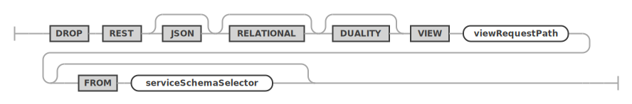

<!-- Copyright (c) 2022, 2023, Oracle and/or its affiliates.

This program is free software; you can redistribute it and/or modify
it under the terms of the GNU General Public License, version 2.0,
as published by the Free Software Foundation.

This program is also distributed with certain software (including
but not limited to OpenSSL) that is licensed under separate terms, as
designated in a particular file or component or in included license
documentation.  The authors of MySQL hereby grant you an additional
permission to link the program and your derivative works with the
separately licensed software that they have included with MySQL.
This program is distributed in the hope that it will be useful,  but
WITHOUT ANY WARRANTY; without even the implied warranty of
MERCHANTABILITY or FITNESS FOR A PARTICULAR PURPOSE.  See
the GNU General Public License, version 2.0, for more details.

You should have received a copy of the GNU General Public License
along with this program; if not, write to the Free Software Foundation, Inc.,
51 Franklin St, Fifth Floor, Boston, MA 02110-1301 USA -->

# DROP

## DROP REST SERVICE

An existing REST service can be dropped by using the `DROP REST SERVICE` statement.

**_SYNTAX_**

```antlr
dropRestServiceStatement:
    DROP REST SERVICE serviceRequestPath
;
```

dropRestServiceStatement ::=


**_Examples_**

The following example drops a REST service with the request path `/myService`.

```sql
DROP REST SERVICE /myService;
```

## DROP REST SCHEMA

An existing REST schema can be dropped by using the `DROP REST SCHEMA` statement.

**_SYNTAX_**

```antlr
dropRestSchemaStatement:
    DROP REST DATABASE schemaRequestPath (
        FROM SERVICE? serviceRequestPath
    )?
;
```

dropRestSchemaStatement ::=


**_Examples_**

The following example drops a REST schema using the request path `/myService`.

```sql
DROP REST SCHEMA /sakila FROM SERVICE /myService;
```

## DROP REST DUALITY VIEW

The `DROP REST DUALITY VIEW` statement is used to drop existing REST duality views.

**_SYNTAX_**

```antlr
dropRestDualityViewStatement:
    DROP REST JSON? RELATIONAL? DUALITY? VIEW
        viewRequestPath (FROM serviceSchemaSelector)?
;
```

dropRestDualityViewStatement ::=


**_Examples_**

The following example drops a REST duality view using the request path `/city`.

```sql
DROP REST DUALITY VIEW /city
FROM SERVICE /myService SCHEMA /sakila;
```

## DROP REST PROCEDURE

The `DROP REST PROCEDURE` statement is used to drop an existing REST procedures.

**_SYNTAX_**

```antlr
dropRestProcedureStatement:
    DROP REST PROCEDURE procedureRequestPath (
        FROM serviceSchemaSelector
    )?
;
```

dropRestProcedureStatement ::=


## DROP REST FUNCTION

The `DROP REST FUNCTION` statement is used to drop an existing REST functions.

**_SYNTAX_**

```antlr
dropRestFunctionStatement:
    DROP_SYMBOL REST_SYMBOL FUNCTION_SYMBOL functionRequestPath (
        FROM_SYMBOL serviceSchemaSelector
    )?
;
```

dropRestFunctionStatement ::=


## DROP REST CONTENT SET

The `DROP REST CONTENT SET` statement is used to drop an existing REST static content set.

**_SYNTAX_**

```antlr
dropRestContentSetStatement:
    DROP REST CONTENT SET contentSetRequestPath (
        FROM SERVICE? serviceRequestPath
    )?
;
```

dropRestContentSetStatement ::=


## DROP REST AUTH APP

The `DROP REST AUTH APP` statement is used to drop an existing REST authentication app from a REST service.

**_SYNTAX_**

```antlr
dropRestAuthAppStatement:
    DROP REST (AUTH | AUTHENTICATION) APP authAppName (
        FROM SERVICE? serviceRequestPath
    )?
;
```

dropRestAuthAppStatement ::=


## DROP REST USER

The `DROP REST USER` statement is used to drop an existing REST user from a REST authentication app.

**_SYNTAX_**

```antlr
dropRestUserStatement:
    DROP REST USER userName AT_SIGN authAppName (
        ON SERVICE? serviceRequestPath
    )?
;
```

dropRestUserStatement ::=

