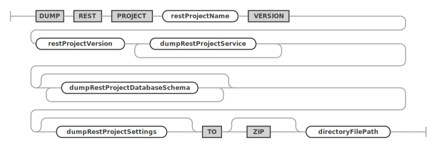
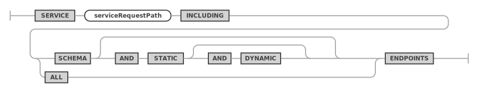
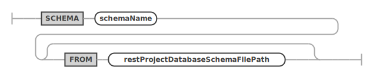
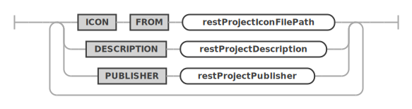
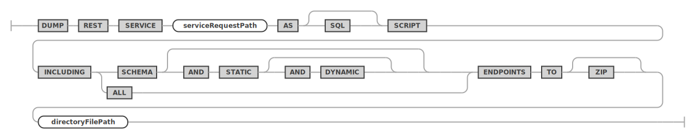

<!-- Copyright (c) 2022, 2025, Oracle and/or its affiliates.

This program is free software; you can redistribute it and/or modify
it under the terms of the GNU General Public License, version 2.0,
as published by the Free Software Foundation.

This program is designed to work with certain software (including
but not limited to OpenSSL) that is licensed under separate terms, as
designated in a particular file or component or in included license
documentation.  The authors of MySQL hereby grant you an additional
permission to link the program and your derivative works with the
separately licensed software that they have either included with
the program or referenced in the documentation.

This program is distributed in the hope that it will be useful,  but
WITHOUT ANY WARRANTY; without even the implied warranty of
MERCHANTABILITY or FITNESS FOR A PARTICULAR PURPOSE.  See
the GNU General Public License, version 2.0, for more details.

You should have received a copy of the GNU General Public License
along with this program; if not, write to the Free Software Foundation, Inc.,
51 Franklin St, Fifth Floor, Boston, MA 02110-1301 USA -->

# DUMP

## DUMP REST PROJECT

An existing REST service can be dumped as REST project by using the `DUMP REST PROJECT` statement.

The command will generate a directory containing the following:

- ```mrs.package.json``` containing the project details
- ```*.service.mrs.sql``` containing the REST SQL for each service
- other SQL files containing schema dumps
- directories containing schema dumps
- ```appIcon.*``` being the icon for this project

This directory may then be zipped into a file.

**_SYNTAX_**

```antlr
dumpRestProjectStatement:
    DUMP REST PROJECT
    restProjectName VERSION restProjectVersion
    (dumpRestProjectService)+
    (dumpRestProjectDatabaseSchema)*
    (dumpRestProjectSettings)?
    TO (ZIP)? directoryFilePath
;

dumpRestProjectService:
    SERVICE serviceRequestPath
        INCLUDING ((DATABASE (AND STATIC (AND DYNAMIC)?)?) | ALL) ENDPOINTS
;

dumpRestProjectDatabaseSchema:
    DATABASE schemaName (FROM restProjectDatabaseSchemaFilePath)?
;

dumpRestProjectSettings: (
        ICON FROM restProjectIconFilePath
        | DESCRIPTION restProjectDescription
        | PUBLISHER restProjectPublisher
    )+
;
```

dumpRestProjectStatement ::=


dumpRestProjectService ::=


dumpRestProjectDatabaseSchema ::=


dumpRestProjectSettings ::=


**_Examples_**

The following example dumps the REST service with the request path `/myService` to a REST project, including the database schema `sakila` it is based on.

```sql
DUMP REST PROJECT 'myServiceProject' VERSION '1.0.0'
    SERVICE /myService INCLUDING ALL ENDPOINTS
    DATABASE `sakila`
    DESCRIPTION 'My first REST project'
    PUBLISHER 'Oracle'
    TO ZIP '~/myServiceProject.zip';
```

Here's a full example to dump a REST service containing most variations of the command.

```sql
DUMP REST PROJECT 'myProject' VERSION '1.0.0'
    SERVICE /myService INCLUDING DATABASE AND STATIC AND DYNAMIC ENDPOINTS
    SERVICE /myService2 INCLUDING ALL ENDPOINTS
    DATABASE `chatApp` FROM '~/mrs_plugin/examples/mrs_chat/db_schema/chat_db_schema.sql'
    DATABASE `chatRestService` FROM '~/mrs_plugin/examples/mrs_chat/db_schema/chat_rest_service.sql'
    DATABASE `chatApp2` FROM '~/mrs_plugin/examples/mrs_chat/db_schema/'
    DATABASE `sakila`
    DESCRIPTION 'This is my first project'
    PUBLISHER 'Oracle'
    ICON FROM '~/icon.svg'
    TO ZIP '~/project.myService.zip';
```
Lets go through the command an explain it in detail.

The first part ```DUMP REST PROJECT 'myProject' VERSION '1.0.0'``` is the project name and version. The version is not strict to any version format, allowing for ```'v1.0'``` or ```'1.0.0b'``` to be valid versions.

Following we have the services that should be included in the project. You can check the
```sql
SERVICE /myService INCLUDING DATABASE AND STATIC AND DYNAMIC ENDPOINTS
```

The service request path is referring to the service required on the project and you are able to include multiple services in the project. Each of these statements will create its own REST SQL file containing all the REST SQL commands to recreate the service. From that service, you choose what to include:
- ```DATABASE``` include REST objects like TABLE, VIEW, PROCEDURE, FUNCTION and SCRIPT
- ```STATIC``` include content sets that are not of SCRIPT type
- ```DYNAMIC``` include content sets that are of SCRIPT type
- ```ALL``` short for ```DATABASE AND STATIC AND DYNAMIC```

Each of these settings are a superset of the former.

Then we have the ```DATABASE``` sub-statements that either dump a schema
```sql
DATABASE `sakila`
```
or uses a SQL file containing the dump of a schema
```sql
DATABASE `chatApp` FROM '~/mrs_plugin/examples/mrs_chat/db_schema/chat_db_schema.sql'
```

Then we can find the project settings. These settings are optional but brings some detail to the project.

- ```DESCRIPTION``` is a short description for the project.
- ```PUBLISHER``` the owner or publisher of the project.
- ```ICON``` will copy an icon file from the specified path.

All this information will be in the ```mrs.package.json``` project file.

Finally there's the ```TO ZIP '~/project.myService.zip'``` which defined the output of the command. The command can generate a directory with all the contents or, if the ```ZIP``` command is used, generate a zip file with the directory contents.

## DUMP REST SERVICE

An existing REST service can be dumped to disk by using the `DUMP REST SERVICE` statement. This dump does not include the database schema that it is based on. To create a fully consistent dump that also includes the database schema, please use the `DUMP REST PROJECT` statement instead.

```antlr
dumpRestServiceStatement:
    DUMP REST SERVICE serviceRequestPath AS (
        SQL
    )? SCRIPT INCLUDING (
        (
            DATABASE (
                AND STATIC (
                    AND DYNAMIC
                )?
            )?
        )
        | ALL
    ) ENDPOINTS TO (ZIP)? directoryFilePath
;
```

dumpRestServiceStatement ::=


**_Examples_**

The following example dumps the REST service with the request path `/myService`.

```sql
DUMP REST SERVICE /myService AS SQL SCRIPT INCLUDING DATABASE AND STATIC AND DYNAMIC ENDPOINTS TO '~/myService.sql'
```
```sql
DUMP REST SERVICE /myService AS SQL SCRIPT INCLUDING ALL ENDPOINTS TO ZIP '~/myService.zip';
```

The service request path is referring to the service required on the project and you are able to include multiple services in the project. This statements will create a REST SQL file containing all the REST SQL commands to recreate the service. From that service, you choose what to include:
- ```DATABASE``` include REST objects like TABLE, VIEW, PROCEDURE, FUNCTION and SCRIPT
- ```STATIC``` include content sets that are not of SCRIPT type
- ```DYNAMIC``` include content sets that are of SCRIPT type
- ```ALL``` short for ```DATABASE AND STATIC AND DYNAMIC```

Each of these settings are a superset of the former.

The destination file is defined with the ```TO``` or ```TO ZIP``` expression when the created file is a REST SQL script or a zipped REST SQL file.
