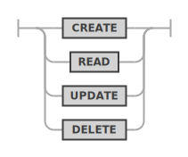
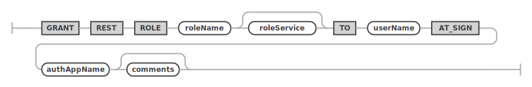

<!-- Copyright (c) 2022, 2025, Oracle and/or its affiliates.

This program is free software; you can redistribute it and/or modify
it under the terms of the GNU General Public License, version 2.0,
as published by the Free Software Foundation.

This program is designed to work with certain software (including
but not limited to OpenSSL) that is licensed under separate terms, as
designated in a particular file or component or in included license
documentation.  The authors of MySQL hereby grant you an additional
permission to link the program and your derivative works with the
separately licensed software that they have either included with
the program or referenced in the documentation.

This program is distributed in the hope that it will be useful,  but
WITHOUT ANY WARRANTY; without even the implied warranty of
MERCHANTABILITY or FITNESS FOR A PARTICULAR PURPOSE.  See
the GNU General Public License, version 2.0, for more details.

You should have received a copy of the GNU General Public License
along with this program; if not, write to the Free Software Foundation, Inc.,
51 Franklin St, Fifth Floor, Boston, MA 02110-1301 USA -->

# GRANT and REVOKE

## GRANT REST

Grants REST privileges on endpoint objects to a role.

**_SYNTAX_**

```antlr
grantRestPrivilegeStatement:
    GRANT REST privilegeList (
        (ON SERVICE? serviceRequestPath)
        | (
            ON serviceSchemaSelector (
                OBJECT objectRequestPath
            )?
        )
    )? TO roleName
;

privilegeList:
    privilegeName
    | privilegeName COMMA privilegeList
;

privilegeName:
    CREATE
    | READ
    | UPDATE
    | DELETE
;

serviceSchemaSelector:
    (SERVICE serviceRequestPath)? DATABASE schemaRequestPath
;

serviceSchemaSelector:
    (SERVICE serviceRequestPath)? DATABASE schemaRequestPath
;
```

grantRestPrivilegeStatement ::=


privilegeList ::=


privilegeName ::=


## GRANT REST ROLE

Grants a REST role to a user account.

**_SYNTAX_**

```antlr
grantRestRoleStatement:
    GRANT REST ROLE roleName TO userName AT_SIGN authAppName
        comments?
;
```

grantRestRoleStatement ::=


## REVOKE REST

Revokes privileges on an REST endpoint object from a role.

**_SYNTAX_**

```antlr
revokeRestPrivilegeStatement:
    REVOKE REST privilegeList (
        (ON SERVICE? serviceRequestPath)
        | (
            ON serviceSchemaSelector (
                OBJECT objectRequestPath
            )?
        )
    )? FROM roleName
;
```

revokeRestPrivilegeStatement ::=


## REVOKE REST ROLE

Revokes a role from a REST user.

**_SYNTAX_**

```antlr
revokeRestRoleStatement:
    REVOKE REST ROLE roleName FROM userName AT_SIGN authAppName
;
```

revokeRestRoleStatement ::=


