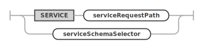
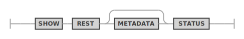
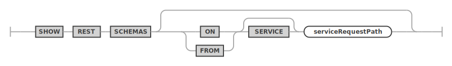
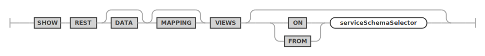
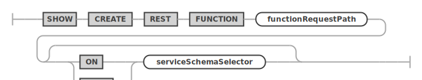

<!-- Copyright (c) 2022, 2024, Oracle and/or its affiliates.

This program is free software; you can redistribute it and/or modify
it under the terms of the GNU General Public License, version 2.0,
as published by the Free Software Foundation.

This program is designed to work with certain software (including
but not limited to OpenSSL) that is licensed under separate terms, as
designated in a particular file or component or in included license
documentation.  The authors of MySQL hereby grant you an additional
permission to link the program and your derivative works with the
separately licensed software that they have either included with
the program or referenced in the documentation.

This program is distributed in the hope that it will be useful,  but
WITHOUT ANY WARRANTY; without even the implied warranty of
MERCHANTABILITY or FITNESS FOR A PARTICULAR PURPOSE.  See
the GNU General Public License, version 2.0, for more details.

You should have received a copy of the GNU General Public License
along with this program; if not, write to the Free Software Foundation, Inc.,
51 Franklin St, Fifth Floor, Boston, MA 02110-1301 USA -->

# USE and SHOW

## USE

An existing REST service can be dropped by using the `DROP REST SERVICE` statement.

**_SYNTAX_**

```antlr
useStatement:
    USE REST serviceAndSchemaRequestPaths
;

serviceAndSchemaRequestPaths:
    SERVICE serviceRequestPath
    | serviceSchemaSelector
;
```

useStatement ::=


serviceAndSchemaRequestPaths ::=


**_Examples_**

The following example makes the REST service with the request path `/myService` the new default REST service.

```sql
USE REST SERVICE /myService;
```

After the default REST service has been set, the following statement can be used to set the default REST schema.

```sql
USE REST SCHEMA /sakila;
```

The next example shows how to set the default REST service and REST schema in a single statement.

```sql
USE REST SERVICE /myService SCHEMA /sakila;
```

## SHOW REST STATUS

The `SHOW REST STATUS` statement is used to get basic information about the current status of the MySQL REST Service.

**_SYNTAX_**

```antlr
showRestMetadataStatusStatement:
    SHOW REST METADATA? STATUS
;
```

showRestMetadataStatusStatement ::=


**_Examples_**

The following example drops a REST schema using the request path `/myService`.

```sql
SHOW REST STATUS;
```

## SHOW REST SERVICES

The `SHOW REST SERVICES` statement lists all available REST services.

**_SYNTAX_**

```antlr
showRestServicesStatement:
    SHOW REST SERVICES
;
```

showRestServicesStatement ::=


**_Examples_**

The following example lists all REST services.

```sql
SHOW REST SERVICES;
```

## SHOW REST SCHEMAS

The `SHOW REST SCHEMAS` statement lists all available REST schemas of the given or current REST service.

**_SYNTAX_**

```antlr
showRestSchemasStatement:
    SHOW REST DATABASES (
        (IN | FROM) SERVICE? serviceRequestPath
    )?
;
```

showRestSchemasStatement ::=


**_Examples_**

The following example lists all REST schemas of the REST service using the request path `/myService`.

```sql
SHOW REST SERVICES FROM /myService;
```

## SHOW REST VIEWS

The `SHOW REST DATA MAPPING VIEWS` statement lists all available REST data mapping views of the given or current REST schema.

**_SYNTAX_**

```antlr
showRestViewsStatement:
    SHOW REST DATA? MAPPING? VIEWS (
        (IN | FROM) serviceSchemaSelector
    )?
;

serviceSchemaSelector:
    (SERVICE serviceRequestPath)? DATABASE schemaRequestPath
;
```

showRestViewsStatement ::=


serviceSchemaSelector ::=


**_Examples_**

The following example lists all REST data mapping views of the given REST schema.

```sql
SHOW REST VIEWS FROM SERVICE /myService SCHEMA /sakila;
```

## SHOW REST PROCEDURES

The `SHOW REST PROCEDURES` statement lists all available REST procedures of the given or current REST schema.

**_SYNTAX_**

```antlr
showRestProceduresStatement:
    SHOW REST PROCEDURES (
        (IN | FROM) serviceSchemaSelector
    )?
;

serviceSchemaSelector:
    (SERVICE serviceRequestPath)? DATABASE schemaRequestPath
;
```

showRestProceduresStatement ::=


serviceSchemaSelector ::=


## SHOW REST FUNCTIONS

The `SHOW REST FUNCTIONS` statement lists all available REST functions of the given or current REST schema.

**_SYNTAX_**

```antlr
showRestFunctionsStatement:
    SHOW REST FUNCTIONS (
        (IN | FROM) serviceSchemaSelector
    )?
;

serviceSchemaSelector:
    (SERVICE serviceRequestPath)? DATABASE schemaRequestPath
;
```

showRestFunctionsStatement ::=


serviceSchemaSelector ::=


**_Examples_**

The following example lists all REST procedures of the given REST schema.

```sql
SHOW REST PROCEDURES FROM SERVICE /myService SCHEMA /sakila;
```

## SHOW REST CONTENT SETS

The `SHOW REST CONTENT SETS` statement lists all available REST content sets of the given or current REST service.

**_SYNTAX_**

```antlr
showRestContentSetsStatement:
    SHOW REST CONTENT SETS (
        (IN | FROM) SERVICE? serviceRequestPath
    )?
;
```

showRestContentSetsStatement ::=


**_Examples_**

The following example lists all REST content sets of the given REST service.

```sql
SHOW REST CONTENT SETS FROM SERVICE /myService;
```

## SHOW REST AUTH APPS

The `SHOW REST AUTH APPS` statement lists all available REST auth apps of the given or current REST service.

**_SYNTAX_**

```antlr
showRestAuthAppsStatement:
    SHOW REST AUTH APPS (
        (IN | FROM) SERVICE? serviceRequestPath
    )?
;
```

showRestAuthAppsStatement ::=


**_Examples_**

The following example lists all REST auth apps of the given REST service.

```sql
SHOW REST AUTH APPS FROM SERVICE /myService;
```

## SHOW CREATE REST SERVICE

The `SHOW CREATE REST SERVICE` statement shows the corresponding DDL statement for the given REST service.

**_SYNTAX_**

```antlr
showCreateRestServiceStatement:
    SHOW CREATE REST SERVICE serviceRequestPath?
;
```

showCreateRestServiceStatement ::=


**_Examples_**

The following example shows the DDL statement for the REST service with request path `/myService`.

```sql
SHOW CREATE REST SERVICE /myService;
```

## SHOW CREATE REST SCHEMA

The `SHOW CREATE REST SCHEMA` statement shows the corresponding DDL statement for the given REST schema.

**_SYNTAX_**

```antlr
showCreateRestSchemaStatement:
    SHOW CREATE REST DATABASE schemaRequestPath? (
        (ON | FROM) SERVICE? serviceRequestPath
    )?
;
```

showCreateRestSchemaStatement ::=


**_Examples_**

The following example shows the DDL statement for the given REST schema.

```sql
SHOW CREATE REST SCHEMA /sakila FROM /myService;
```

## SHOW CREATE REST VIEW

The `SHOW CREATE REST DATA MAPPING VIEW` statement shows the corresponding DDL statement for the given REST data mapping view.

**_SYNTAX_**

```antlr
showCreateRestViewStatement:
    SHOW CREATE REST DATA? MAPPING? VIEW viewRequestPath (
        (ON | FROM) serviceSchemaSelector
    )?
;

serviceSchemaSelector:
    (SERVICE serviceRequestPath)? DATABASE schemaRequestPath
;
```

showCreateRestViewStatement ::=


serviceSchemaSelector ::=


**_Examples_**

The following example shows the DDL statement for the given REST data mapping view.

```sql
SHOW CREATE REST VIEW /city ON SERVICE /myService SCHEMA /sakila;
```

## SHOW CREATE REST PROCEDURE

The `SHOW CREATE REST PROCEDURE` statement shows the corresponding DDL statement for the given REST procedure.

**_SYNTAX_**

```antlr
showCreateRestProcedureStatement:
    SHOW CREATE REST PROCEDURE procedureRequestPath (
        (ON | FROM) serviceSchemaSelector
    )?
;

serviceSchemaSelector:
    (SERVICE serviceRequestPath)? DATABASE schemaRequestPath
;
```

showCreateRestProcedureStatement ::=


serviceSchemaSelector ::=


## SHOW CREATE REST FUNCTION

The `SHOW CREATE REST FUNCTION` statement shows the corresponding DDL statement for the given REST function.

**_SYNTAX_**

```antlr
showCreateRestFunctionStatement:
    SHOW CREATE REST FUNCTION functionRequestPath (
        (ON | FROM) serviceSchemaSelector
    )?
;

serviceSchemaSelector:
    (SERVICE serviceRequestPath)? DATABASE schemaRequestPath
;
```

showCreateRestFunctionStatement ::=


serviceSchemaSelector ::=


**_Examples_**

The following example shows the DDL statement for the given REST procedure.

```sql
SHOW CREATE REST PROCEDURE /inventory_in_stock ON SERVICE /myService SCHEMA /sakila;
```

## SHOW CREATE AUTH APP

The `SHOW CREATE AUTH APP` statement shows the corresponding DDL statement for the given REST auth app.

**_SYNTAX_**

```antlr
showCreateRestAuthAppStatement:
    SHOW CREATE REST AUTH APP authAppName (
        (ON | FROM) SERVICE? serviceRequestPath
    )?
;
```

showCreateRestAuthAppStatement ::=


**_Examples_**

The following example shows the DDL statement for the given REST auth app.

```sql
SHOW CREATE REST AUTH APP "MRS" FROM SERVICE localhost/myTestService;
```

## SHOW REST ROLES

Shows a list of roles, optionally filtered by service or auth app and users that were granted the role.

**_SYNTAX_**

```antlr
showRestRolesStatement:
    SHOW REST ROLES (
        (ON | FROM) (ANY SERVICE | SERVICE? serviceRequestPath)
    )? (FOR userName? AT_SIGN authAppName)?
;
```

showRestRolesStatement ::=


## SHOW REST GRANTS

Show the list of REST privileges that were granted to the given role.

**_SYNTAX_**

```antlr
showRestGrantsStatement:
    SHOW REST GRANTS FOR roleName
;
```

showRestGrantsStatement ::=

