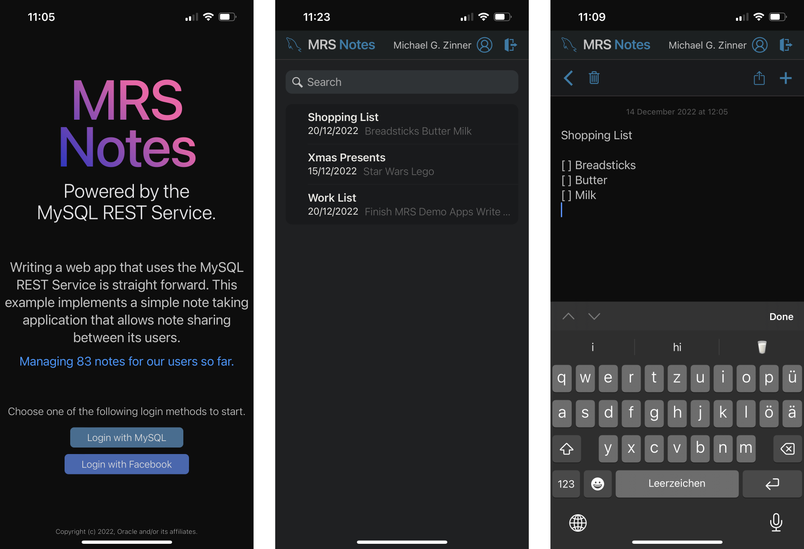
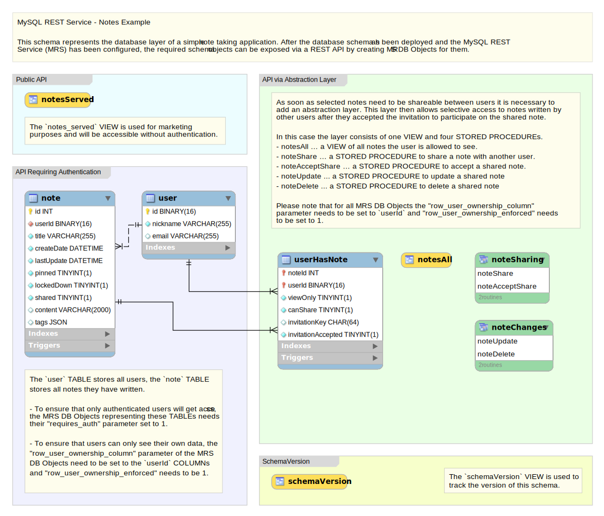

<!-- Copyright (c) 2022, 2024, Oracle and/or its affiliates.

This program is free software; you can redistribute it and/or modify
it under the terms of the GNU General Public License, version 2.0,
as published by the Free Software Foundation.

This program is designed to work with certain software (including
but not limited to OpenSSL) that is licensed under separate terms, as
designated in a particular file or component or in included license
documentation.  The authors of MySQL hereby grant you an additional
permission to link the program and your derivative works with the
separately licensed software that they have either included with
the program or referenced in the documentation.

This program is distributed in the hope that it will be useful,  but
WITHOUT ANY WARRANTY; without even the implied warranty of
MERCHANTABILITY or FITNESS FOR A PARTICULAR PURPOSE.  See
the GNU General Public License, version 2.0, for more details.

You should have received a copy of the GNU General Public License
along with this program; if not, write to the Free Software Foundation, Inc.,
51 Franklin St, Fifth Floor, Boston, MA 02110-1301 USA -->

## MRS Notes Example

The MRS Notes example implements a simple note taking application as a [Progressive Web Apps (PWA)](https://en.wikipedia.org/wiki/Progressive_web_app) that allows for sharing notes between users.

### MRS Notes Developer Showcase

The following features are showcased in this example.

- Accessing MRS REST endpoints from JavaScript and TypeScript code.
- Using MRS service authentication REST endpoints to support user management
- Using [JSON Web Tokens (JWT)](https://jwt.io/) to manage user sessions

### MRS Notes Quick Guide

To quickly get the MRS Notes Examples working, please feel free to follow this guide. If you want to learn more about the examples, please continue reading the chapters below.

The following steps need to be taken to setup, build and deploy the MRS Notes example project on the MySQL REST Service.

1. Save the MRS Notes Example project to disk and open it with VS Code `VSCodeProject:examples/mrs_notes`
2. [Configure](#configuring-mysql-rest-service) the MySQL REST Service.
3. Create a new MRS service (e.g. `/myService`).
4. Deploy the mrs_notes MySQL database schema `examples/mrs_notes/db_schema/mrs_notes.sql`
5. Load the MRS schema dump into the MRS service `examples/mrs_notes/mrs_schema/mrsNotes.mrs.json`
6. Ensure a bootstrapped MySQL Router instance is running (if not, start it).
7. Build and deploy the app by following the steps below.

#### Deploying the TypeScript Example

The MrsNotes project implements a TypeScript demo app that allows to create, manipulate and share notes between users.

1. If you have not done so in the previous section, save the following project to disk and open it with VS Code `VSCodeProject:examples/mrs_notes`
2. After the project folder has been opened in VS Code, navigate to the `NPM SCRIPTS` View in the sidebar and right-click on `package.json` to select `Run Install`. Alternatively, set the focus to the TERMINAL tab and enter `npm install` to install the required node modules
3. In the `NPM SCRIPTS` View, run the `package.json/build` command that will create a folder called `dist` that contains all files needed for deployment.
4. Right click on the `dist` folder in the Folders view and select `Upload Folder to MySQL REST Service` from the popup menu.
5. In the REST Content Set dialog set the `Request Path` the app should be using, e.g. `/app` and click `OK` to upload the files to the MRS service.
6. Open a web browser and access the full path specified in the previous step to open the app, e.g. `https://localhost:8444/myService/app/index.html`

### MRS Setup and Configuration for the MRS Notes Examples

Please refer to the MRS documentation on how to setup and configure a MRS service in detail.

If you are using a local MRS deployment deployment you can use these simplified steps.

### Deploy the mrsNotes MySQL database schema

The mrsNotes MySQL database schema is the center of the MRS project. It defines the structure of the data and its database tables store all the information the users enter while using the app.

To create the mrsNotes schema the corresponding SQL script file needs to be executed. This can be done via the MySQL Shell or directly within VS Code using the MySQL Shell for VS Code extension.

- If you are browsing this documentation within VS Code click the button next to the SQL script name `examples/mrs_notes/db_schema/mrs_notes.sql`
- If you want to use MySQL Shell on the command line, switch to the mrs_notes plugin directory and run the following command.

    mysqlsh dba@localhost --sql -f examples/mrs_notes/db_schema/mrs_notes.sql

#### mrsNotes EER Diagram

The following diagram shows all components of the mrsNotes schema.

The most important database table is the `note` table. It stores all notes that are created by the users.

The `user` table holds the nickname of the user as well as the email address used for receiving invitation emails for shared notes.

The `user_has_note` table is used to managed the sharing of notes with other users.

As soon as selected notes need to be shareable between users it is necessary to add an
abstraction layer. This layer then allows selective access to notes written by other users
after they accepted the invitation to participate on the shared note.

In this case the layer consists of one VIEW and four STORED PROCEDUREs.

- notes_all … a VIEW of all notes the user is allowed to see.
- note_share … a STORED PROCEDURE to share a note with another user.
- note_accept_share … a STORED PROCEDURE to accept a shared note.
- note_update ... a STORED PROCEDURE to update a shared note
- note_delete ... a STORED PROCEDURE to delete a shared note
